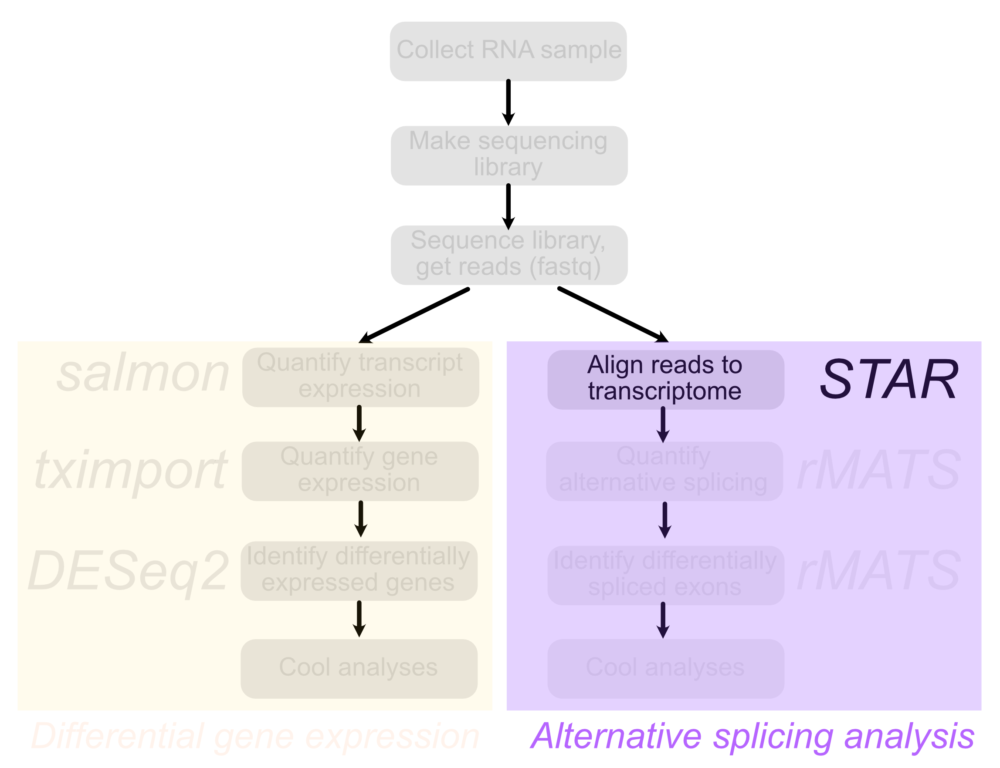
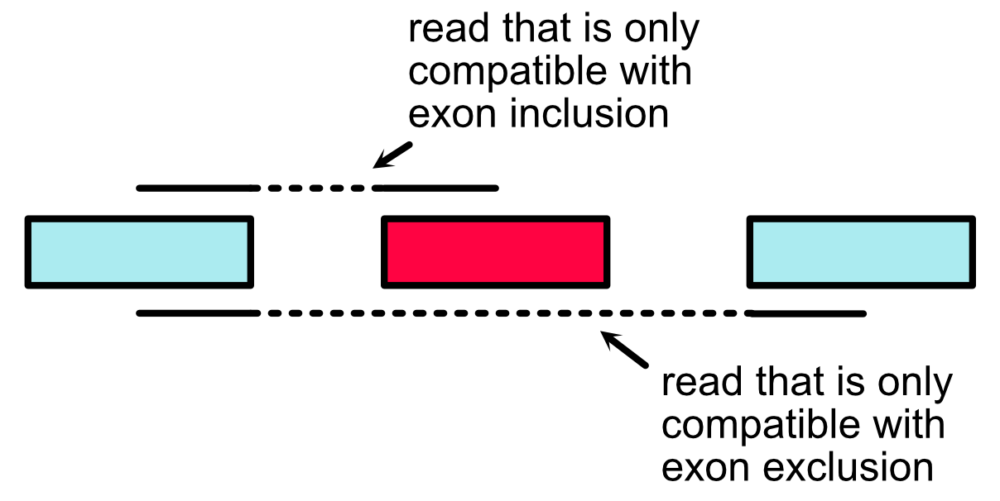
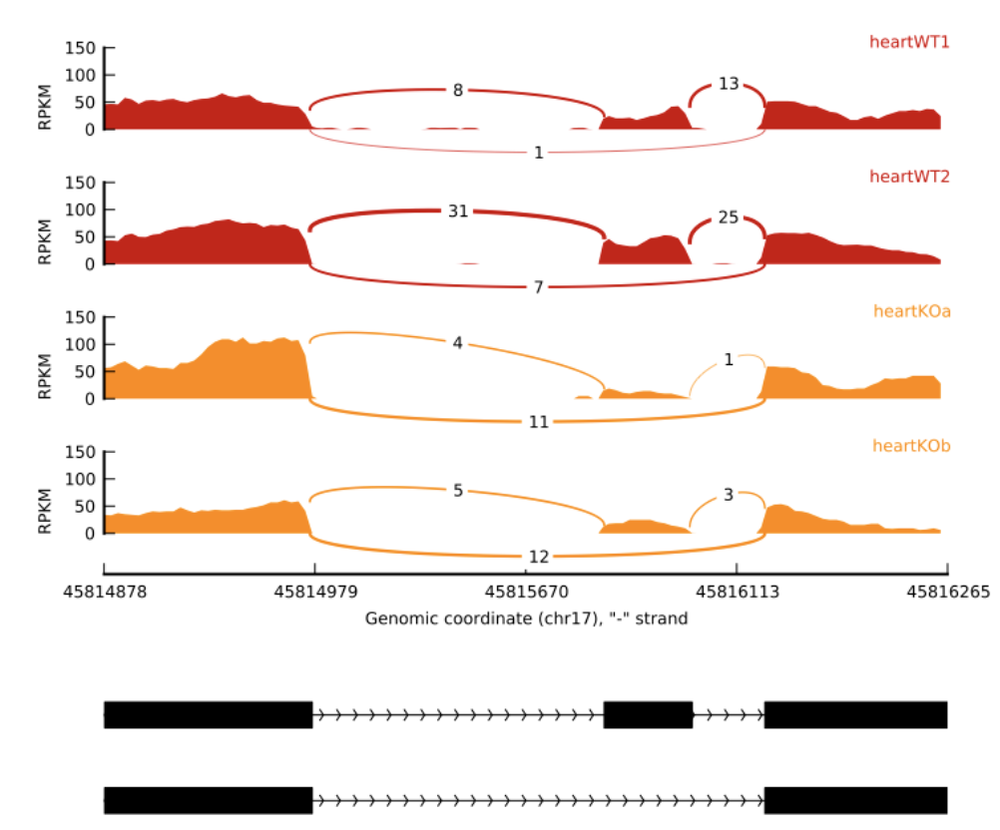
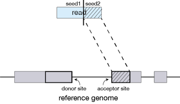
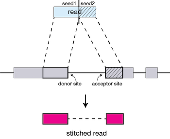
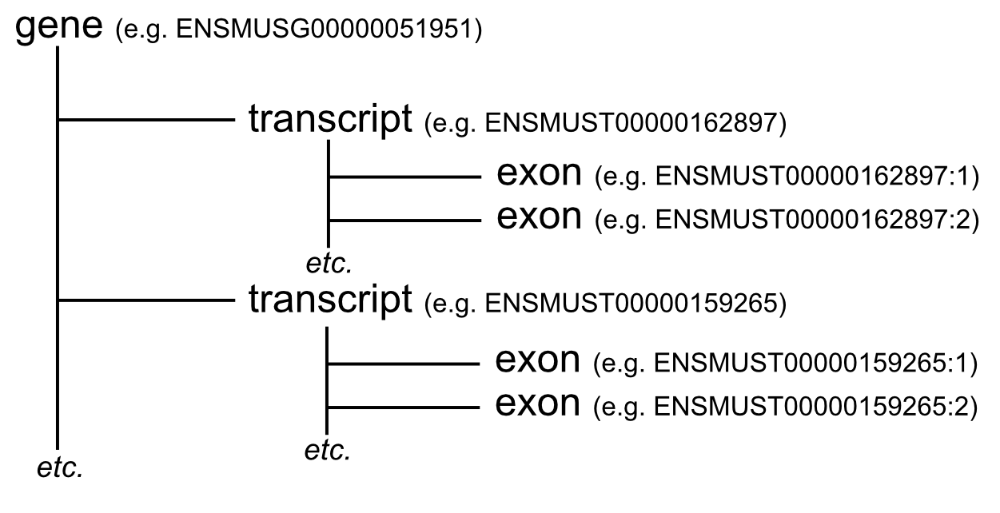

```{r run-setup---dont-delete, child = "slide-setup.Rmd"}
```

layout: true

<div class="my-footer">
  <span>
  Matthew Taliaferro | Alternative splicing: STAR | <a href="https://molb7950.netlify.app/">MOLB 7950 website</a>
  </span>
</div> 

---
```{css echo=FALSE}
.highlight-last-item > ul > li, 
.highlight-last-item > ol > li {
  opacity: 0.5;
}
.highlight-last-item > ul > li:last-of-type,
.highlight-last-item > ol > li:last-of-type {
  opacity: 1;
}

.red { color: red; }
.orange { color: orange; }
.blue { color: blue; }
.small {font-size: 60%; }
.big {font-size: 300%; }
.underline {text-decoration: underline; }

pre {
  max-width: 100%;
  overflow-x: scroll;
}
```

# Contact Info 

### Greetings experimentalist humans `r emo::ji("wave")`

<i class="fa fa-envelope"></i> &nbsp; [matthew.taliaferro@cuanschutz.edu](mailto:matthew.taliaferro@cuanschutz.edu) <br>

---
class: highlight-last-item

# Learning Objectives

###By the end of the class, you should be able to:

- Define the challenges faced by aligning RNAseq reads to the transcriptome

--
- Understand how `STAR` approaches these challenges

--
- Be able to run `STAR` to align RNAseq reads to the transcriptome

--
- Understand the SAM file format 


---

# Rigor & Reproducibility

.pull-left[As with all computational **experiments** (yes, they are experiments, don't let your pipette-toting friends tell you otherwise), keeping track of what you did is key. In the old days, I kept a written notebook of commands that I ran.  Sounds silly, but there were many times that I went back to that notebook to see exactly what the parameters were for a given run using a piece of software.

Today, there are better options. You are using one of the better ones right now.  Notebooks, including RMarkdown (mainly for R) and Jupyter (mainly for Python), are a great way to keep track of what you did as well as give justification or explanation for your analyses using plain 'ol English.


Trust me, one day you will be glad you used them. The Methods section of your paper is never fun to write without them.]

.pull-right[.center[
```{r echo = FALSE, out.width = '35%'}
knitr::include_graphics('img/Rmarkdown.jpg')
```
]

.center[
```{r echo = FALSE, out.width = '35%'}
knitr::include_graphics('img/jupyter.png')
```
]]


---
class: highlight-last-item

# Problem Set and Grading Rubric

Today's problem set is composed of 3 problems. 

--

- In the first, you will use `STAR` to align some RNAseq reads to the mouse transcriptome. This problem is worth 30% of the total points.

--


- In the second, you will count how many reads in your alignment cross a splice junction. This problem is worth 35% of the total points.

--


- In the third, you will find the longest genomic span covered by a single read pair. This problem is worth 35% of the total points.

---

# Further reading

If you are interested, here is a little more information about today's topic that you can read later:

.pull-left[ 
- The [paper](https://www.ncbi.nlm.nih.gov/pmc/articles/PMC3530905/) describing `STAR`
- The [documentation](https://github.com/alexdobin/STAR/blob/master/doc/STARmanual.pdf) for the latest version of `STAR`
- In-depth information about what is contained within [SAM files](https://samtools.github.io/hts-specs/SAMv1.pdf)
]

---

# Overview

.pull-left[
Last week we talked about quantifying transcript expression with RNAseq and using it to identify genes that were differentially expressed across conditions.
]
.pull-right[
```{r echo = FALSE, out.width = '120%'}
knitr::include_graphics('img/flowchart.png')
```
]

---

# Overview

.pull-left[
This week we will focus on the analysis of .red[*alternative splicing*].

Unlike last week when we could move straight from raw reads in a `fastq` file to transcript quantifications, this week we will need an intermediate step: read alignment. 

There are several software packages made for aligning RNAseq reads to the genome/transcriptome. One of the more popular ones, and the one we will use is called `STAR`.
]

.pull-right[
```{r echo = FALSE, out.width = '120%'}

```
]

---

#Alternative splicing

.pull-left[
As you may know, the vast majority of mammalian protein-coding genes contain introns. In fact most contain *many* introns, meaning they have many exons. Not every one of these exons, or pieces of an exon, has to be included in every transcript.

The inclusion of these exons is often regulated through the binding of RNA binding proteins to specific sequences in the exon and in the flanking introns.
]

.pull-right[
```{r echo = FALSE, out.width = '120%'}
knitr::include_graphics('img/AStypes.png')
```
.right[.small[wormbook]
]
]

---

#Reads that inform us about alternative splicing

.pull-left[
In order tell which exons were included in a transcript, we need to know more than just which transcript a read came from. We need to know *where* in the transcript it came from.

The most informative reads with regards to alternative splicing are those that **cross a splice junction**. Those reads tell us unambiguously that two exons were connected together in the transcript. If we are considering the inclusion of an alternative exon, a *junction read* could link the alternative exon to one of its neighbors, indicating that the alternative exon was included. Alternatively `r emo::ji("laugh")`, a junction read could link the two neighbor exons together, indiciating that the alternative exon was not included.
]

.pull-right[
```{r echo = FALSE, out.width = '120%'}

```
]

---

# Junction reads in practice

.pull-left[
We can use the relative number of reads that support inclusion or exclusion to learn something about how often an exon was included in a sample.

Consider the plots on the right. These are called **sashimi** `r emo::ji("sushi")` plots.

We are quantifying the inclusion of the middle exon. Each row is an RNAseq sample where the height of the color indicates read depth at that location. The arcs that connect exons are junction reads. In the .red[red samples], there are many more reads that support exon inclusion (i.e. go from the middle exon to a flanking exon) than support exclusion (i.e. go from one flanking exon to the other). In the .orange[orange samples], this trend is reversed. 

We can therefore say that the exon is more often included in the .red[red samples] than the .orange[orange samples].
]

.pull-right[
```{r echo = FALSE, out.width = '120%'}

```
.right[.small[ MISO documentation]
]
]

---

# Aligning RNAseq reads to the genome

.pull-left[
If we are going to take this approach, we need to know *where* in the genome each read came from. What we want to do is take each read and **align** it against the genome, retrieving the genomic **coordinates** of its location. You have already done this in the DNA module using `bowtie`. 

You might immediately see a problem, though. Many reads will not *contiguously* map to the genome. Specifically, the junction reads that we are so interested in will have two regions of alignment (one for each exon) separated by a gap (the intron).

`bowtie` is not going to like this. However, an aligner made for RNAseq, like `STAR` will be able to handle this.
]

.pull-right[.center[.big[
`r emo::ji("star-struck")`
`r emo::ji("star-struck")`
`r emo::ji("star-struck")`
`r emo::ji("star-struck")`
`r emo::ji("star-struck")`
`r emo::ji("star-struck")`
`r emo::ji("star-struck")`
`r emo::ji("star-struck")`
`r emo::ji("star-struck")`
`r emo::ji("star-struck")`
`r emo::ji("star-struck")`
`r emo::ji("star-struck")`
]
]
.right[.small[Yes, I recently learned how to insert emojis]]
]
---

# How `STAR` works

.pull-left[
STAR begins by finding matches (either unique or nonunique) between a portion of a read and the reference. This matching region of the query is extended along the reference until the two start to disagree. 

If this match extends all the way through to the end of the read, then the read lies completely within one exon (or intron, or I guess intergenic region if you are bad at making RNAseq libraries) and we are done. If the match ends before the end of the read, the part that has matched so far defines one *seed*. 
]

.pull-right[
```{r echo = FALSE, out.width = '120%'}
knitr::include_graphics('img/seed1.png')
```
.right[.small[Harvard Chan Bioinformatics Core]]]

---

# How `STAR` works

.pull-left[
STAR then takes the rest of the query and uses it to find the best match to its sequence in the reference, defining another **seed**. 
]

.pull-right[
```{r echo = FALSE, out.width = '120%'}

```
.right[.small[Harvard Chan Bioinformatics Core]]]

---

# How `STAR` works

.pull-left[
If, during the extension of a match a small region of mismatch or discontinuity occurs, these can be identified as mutations or indels if high-quality matches between the query and reference resume later in the read. 
]

.pull-right[
```{r echo = FALSE, out.width='70%', out.height='70%', eval = TRUE}
knitr::include_graphics('img/indel.png')
```
]

---

# How `STAR` works

.pull-left[
After aligning seeds, they can be stitched together. 

The stitching of seeds with high alignment quality (low number of indels, mismatches) is prefered over the stitching of seeds with low alignment quality (high number of indels, mismatches).
]

.pull-right[
```{r echo = FALSE, out.width = '120%'}

```
.right[.small[Harvard Chan Bioinformatics Core]]]

---

# Genome annotations

.pull-left[
So if `STAR` is going to do this, it needs to know where the introns are. Although it can find "new" (i.e. unannotated) introns, unless we were specifically looking for new ones, we would probably have much more confidence in introns that had been seen before.

We can provide those introns that people agree exist in the form of a genome annotation. There are a few flavors of genome annotation, but the one we will use is called **GFF** (.underline[G]eneral .underline[F]eature .underline[F]ormat). General information about the GFF format can be found [here](https://uswest.ensembl.org/info/website/upload/gff.html).

GFF files are hierarchical in nature. There can be many levels in this hierarchy. Parents have children, grandchildren, and so on. For our purposes, the top level feature will be a .red[gene]. Genes have children .red[transcripts] which in turn have children .red[exons].
]

.pull-right[
```{r echo = FALSE, out.width = '120%'}

```
.center[Where are the introns in this diagram?]]

---
class: highlight-last-item

# GFF file format

Let's take a look at one of these files. This is drawn from the annotation for mouse chromosome 19.

.code[
```{bash gffhead, eval = FALSE}
head -n 4 data/dummySTAR/MOLB7950.gff3
```

]

.plot[
```{bash gffhead-out, ref.label='gffhead', echo = FALSE}
```

]

--

We can see that each line corresponds to one .blue[feature]. The first feature is a .red[gene]. It:

--
- Lives on chromosome 19.

--
- Begins at position 3065711 (just to add confusion, GFF files start at 1, BED files start at 0)

--
- Ends at position 3197714

--
- Is on the minus strand (this isn't DNA anymore...strand matters!)

--

The gene .blue[feature] contains a child .red[transcript] .blue[feature].  

Its properties are similarly outlined (*scroll right*).

---
class: highlight-last-item

#Running STAR -- creating an index
The first thing we need to do is have STAR create an **index**, storing information about the annotation and where things are. The relevant options we will need to pay attention to when doing this are shown below:

--
* **--runMode** genomeGenerate (we are making an index, not aligning reads)

--
* **--genomeDir** /path/to/genomeDir (where you want STAR to put this index we are making)

--
* **--genomeFastaFiles** /path/to/genomesequence (genome sequence as fasta, either one file or multiple)

--
* **--sjdbGTFfile** /path/to/annotations.gff (yes it says gtf, but we are going to use a gff format)

--
* **--sjdbOverhang** 100 (100 will usually be a good value here, the recommended value is readLength - 1)

--
* **--sjdbGTFtagExonParentTranscript** Parent (we have to specify this because we are using a gff annotation and this is how gff files denote relationships)

--
* **--genomeSAindexNbases** 11 (don't worry about this one, we are specifying it because we are using an artifically small genome in this example)

--
Now we are ready to make our index.  This should take a couple minutes.

.code[
```{bash STARindex, eval = FALSE}
/Users/mtaliaferro/miniconda2/envs/three/bin/STAR --runMode genomeGenerate /
--genomeDir data/dummySTAR/dummySTARindex --genomeFastaFiles /
data/dummySTAR/chr19.fasta --sjdbGTFfile /
data/dummySTAR/MOLB7950.gff3 --sjdbOverhang 100 --sjdbGTFtagExonParentTranscript Parent --genomeSAindexNbases 11
```

]
---
class: highlight-last-item

## Running STAR -- aligning reads

Now that we have our index we are ready to align our reads.  The options we need to pay attention to here are:

--
* **--runMode** alignReads (we are aligning this time)

--
* **--genomeDir** /path/to/genomeDir (a path to the index we made in the previous step)

--
* **--readFilesIn** /path/to/forwardreads /path/to/reversereads (paths to our fastqs, separated by a space)

--
* **--readFilesCommand** gunzip -c (our reads our gzipped so we need to tell STAR how to read them)

--
* **--outFileNamePrefix** path/to/outputdir (where to put the results)

--
* **--outSAMtype** BAM SortedByCoordinate (the format of the alignment output, more on this later)

--
Now we are ready to align our reads.

```{bash STARalign, eval = FALSE}
/Users/mtaliaferro/miniconda2/envs/three/bin/STAR --runMode alignReads --genomeDir /
data/dummySTAR/dummySTARindex/ --readFilesIn /
data/dummySTAR/MOLB7950_1.fastq.gz /
data/dummySTAR/MOLB7950_2.fastq.gz /
--readFilesCommand gunzip -c --outFileNamePrefix data/dummySTAR/MOLB7950/dummy /
--outSAMtype BAM SortedByCoordinate
```

What does `STAR` give us as an output? We'll look at that in the exercises.
