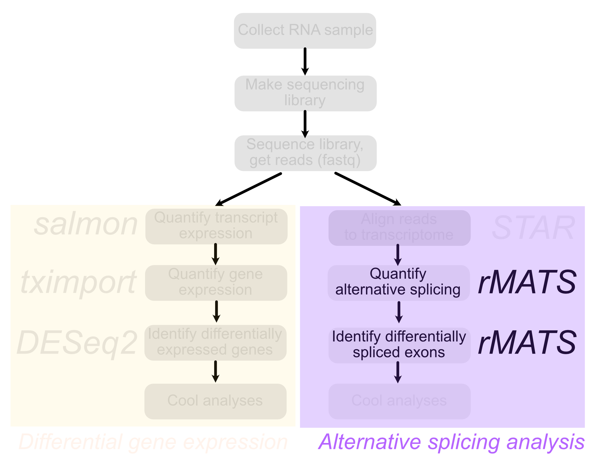
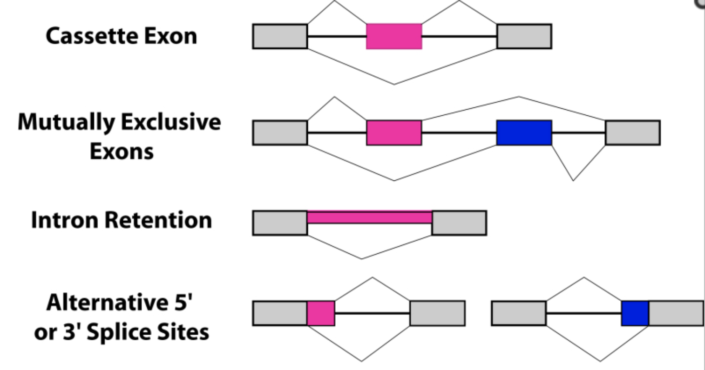
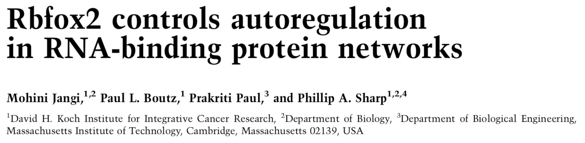
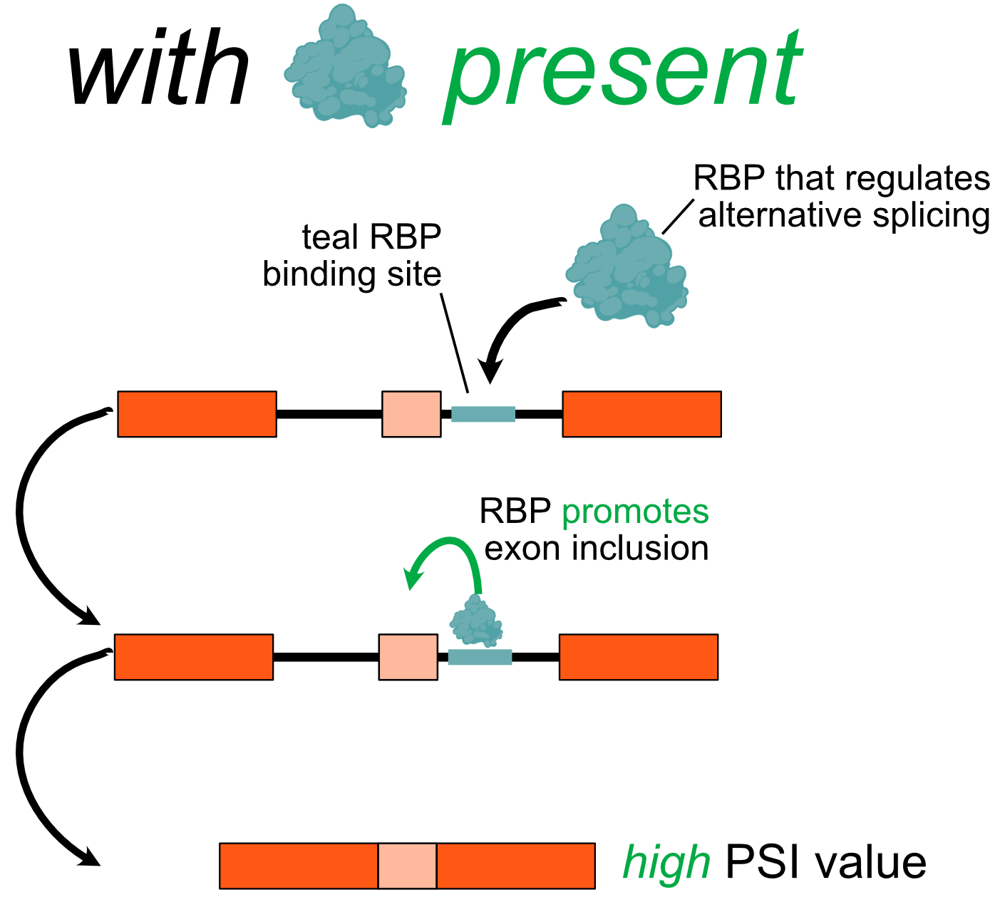
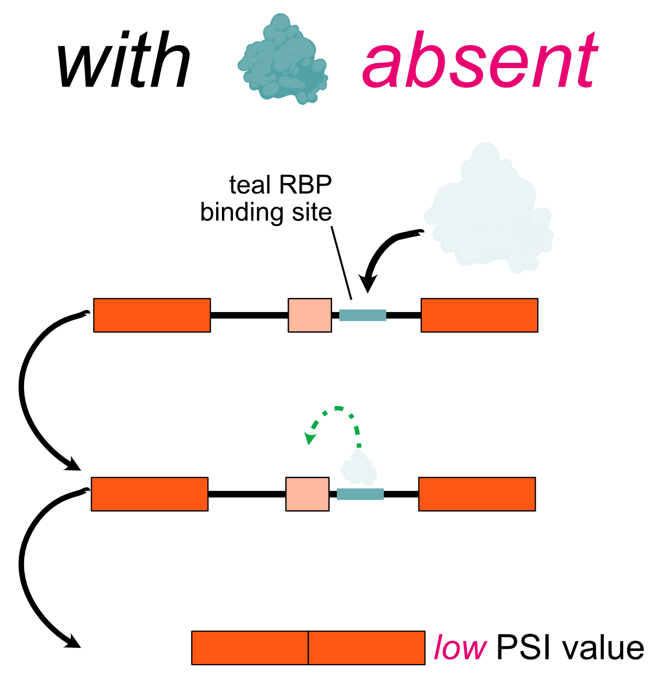
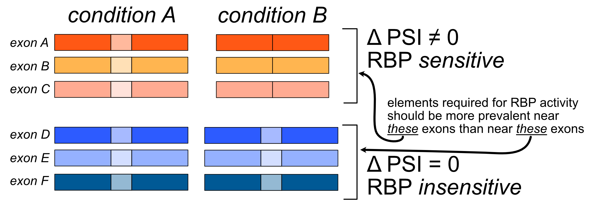

```{r run-setup---dont-delete, child = "slide-setup.Rmd"}
```

layout: true

<div class="my-footer">
  <span>
  Matthew Taliaferro | Alternative splicing: rMATS | <a href="https://molb7950.netlify.app/">MOLB 7950 website</a>
  </span>
</div> 

---

# Contact Info 

### Greetings experimentalist humans `r emo::ji("wave")`

<i class="fa fa-envelope"></i> &nbsp; [matthew.taliaferro@cuanschutz.edu](mailto:matthew.taliaferro@cuanschutz.edu) <br>

---
class: highlight-last-item

# Learning Objectives

###By the end of the class, you should be able to:

- Define the meaning and rationale behind the "percent spliced in" (PSI) metric for alternative splicing analysis

--
- Use `rMATS` to analyze alternative splicing using RNAseq data

--
- Parse and filter `rMATS` output to derive meaningful insights

--


---

# Rigor & Reproducibility

.pull-left[As with all computational **experiments** (yes, they are experiments, don't let your pipette-toting friends tell you otherwise), keeping track of what you did is key. In the old days, I kept a written notebook of commands that I ran.  Sounds silly, but there were many times that I went back to that notebook to see exactly what the parameters were for a given run using a piece of software.

Today, there are better options. You are using one of the better ones right now.  Notebooks, including RMarkdown (mainly for R) and Jupyter (mainly for Python), are a great way to keep track of what you did as well as give justification or explanation for your analyses using plain 'ol English.


Trust me, one day you will be glad you used them. The Methods section of your paper is never fun to write without them.]

.pull-right[.center[
```{r echo = FALSE, out.width = '35%'}
knitr::include_graphics('img/Rmarkdown.jpg')
```
]

.center[
```{r echo = FALSE, out.width = '35%'}
knitr::include_graphics('img/jupyter.png')
```
]]


---
class: highlight-last-item

# Problem Set and Grading Rubric

Today's problem set is composed of 2 problems. 

--

- In the first, you will receive an `rMATS` output file. You will be tasked with filtering the events by read coverage and then plotting the difference in PSI values and their statistical significance using a volcano plot. This problem is worth 50% of the total points.

--


- In the second, you will take the filtered (by read coverage) `rMATS` output and plot the PSI values statistically significant events using a heatmap. This will allow you to easily judge the consistency of PSI values across replicates in these events. This problem is worth 50% of the total points.


---

# Further reading

If you are interested, here is a little more information about today's topic that you can read later:

.pull-left[ 
- The [paper](https://www.ncbi.nlm.nih.gov/pmc/articles/PMC4280593/) describing `rMATS`
- The [documentation](http://rnaseq-mats.sourceforge.net/) for the latest version of `rMATS`
]

---

# Overview

.pull-left[
Last time we talked about using `STAR` to align RNAseq reads to the transcriptome. We talked about why this was important for alternative splicing analysis given that we need to know exactly *where* in transcripts these reads are mapping.

Today we will talk about taking the alignments that we produced (OK not those exact alignments, but still) and using them to determine how the inclusion of alternative exons in transcripts varies between conditions. 
]
.pull-right[
```{r echo = FALSE, out.width = '120%'}
knitr::include_graphics('img/flowchart.png')
```
]

---

# Overview

.pull-left[
Today we will continue our focus on the analysis of .red[*alternative splicing*].

As is the case for many computational biology questions, there are many software choices when it comes to alternative splicing. The one that we will use is called `rMATS`. 

`rMATS` will take data about where reads align and where alternative exons are to determine how often an exon is included in a sample. It will quantify this using a metric called PSI (.underline[P]ercent .underline[S]pliced .underline[In]). 

`rMATS` will then compare PSI values between replicates and across experimental conditions to identify alternative splicing events whoe PSI values are significantly different across conditions.
]

.pull-right[
```{r echo = FALSE, out.width = '120%'}

```
]

---

#Alternative splicing

.pull-left[
As you may know, the vast majority of mammalian protein-coding genes contain introns. In fact most contain *many* introns, meaning they have many exons. Not every one of these exons, or pieces of an exon, has to be included in every transcript.

The inclusion of these exons is often regulated through the binding of RNA binding proteins to specific sequences in the exon and in the flanking introns.

The data we will examine today came from an experiment probing the function of one of these RNA binding proteins, **RBFOX2**. More on that later.
]

.pull-right[
```{r echo = FALSE, out.width = '120%'}

```
.right[.small[wormbook]
]
]

---

#Reads that inform us about alternative splicing

.pull-left[
In order tell which exons were included in a transcript, we need to know more than just which transcript a read came from. We need to know *where* in the transcript it came from.

The most informative reads with regards to alternative splicing are those that **cross a splice junction**. Those reads tell us unambiguously that two exons were connected together in the transcript. If we are considering the inclusion of an alternative exon, a *junction read* could link the alternative exon to one of its neighbors, indicating that the alternative exon was included. Alternatively `r emo::ji("laugh")` (was this funny this time?), a junction read could link the two neighbor exons together, indiciating that the alternative exon was not included.
]

.pull-right[
```{r echo = FALSE, out.width = '120%'}
knitr::include_graphics('img/junctionreads.png')
```
]

---

# Junction reads in practice

.pull-left[
We can use the relative number of reads that support inclusion or exclusion to learn something about how often an exon was included in a sample.

Consider the plots on the right. These are called **sashimi** `r emo::ji("sushi")` plots.

We are quantifying the inclusion of the middle exon. Each row is an RNAseq sample where the height of the color indicates read depth at that location. The arcs that connect exons are junction reads. In the .red[red samples], there are many more reads that support exon inclusion (i.e. go from the middle exon to a flanking exon) than support exclusion (i.e. go from one flanking exon to the other). In the .orange[orange samples], this trend is reversed. 

We can therefore say that the exon is more often included in the .red[red samples] than the .orange[orange samples].
]

.pull-right[
```{r echo = FALSE, out.width = '120%'}
knitr::include_graphics('img/sashimi.png')
```
.right[.small[ MISO documentation]
]
]

---

# Today's data

Today, we will use data produced as part of a study into the function of the RNA binding protein **RBFOX2**.

```{r echo = FALSE, out.width = '120%'}

```

---

# Studying RNA regulation through RBP perturbation / RNAseq

.pull-left[
A common strategy in the study of RNA processing is to take an RBP you are interested in, perturb it, and ask how the transcriptome looks before and after this perturbation. This is part of what the authors did in today's paper.

{{content}}

]

--

Imagine you were studying an RBP that promoted inclusion of an alternative exon by binding the intron downstream of exons that it controls.

--
.pull-right[
```{r echo = FALSE, out.width = '75%'}

```
]

---

# Studying RNA regulation through RBP perturbation / RNAseq

.pull-left[
Now imagine that you perturbed that RBP, say, by knocking its expression down.  What would happen?

{{content}}

]
--

Exons that depended on that RBP for efficient inclusion would now be included in transcripts much less frequently.  In this example, their PSI values would *decrease*. 

However, other exons don't really care about whether this RBP is around or not. Their PSI values will be generally unaffected.

--

.pull-right[
```{r echo = FALSE, out.width = '75%'}

```
]

---

# Uncovering biochemical mechanism through genomics

.pull-far-left[
Identifying RBP-sensitive exons in this manner therefore tells us two things:
- The functional splicing targets of the RBP
- Motifs that are associated with whether or not an exon is sensitive to RBP perturbation
 * These could be elements in the RNA that the RBP recognizes to direct its activity to this location
 
]

.oppo-far-left[
```{r echo = FALSE, out.width = '100%'}

```

.blue[More on this in the next class. For now, let's focus on running `rMATS` and figuring out its output.]
]

---
class: highlight-last-item
#Run rMATS
`rMATS` is going to want two things: 

- The locations of alternative exons (provided as a `gtf` genome annotation file)

--
- The locations of your read alignments, in `bam` format

--

See the documentation [here](https://github.com/Xinglab/rmats-turbo/blob/v4.1.0/README.md). The relevant options we will need to pay attention to when doing this are shown below:

--
* **--b1** /path/to/b1.txt (path to a text file that contains paths to all BAM files for samples in condition 1, .red[i.e. RBP perturbation])

--
* **--b2** /path/to/b2.txt (path to a text file that contains paths to all BAM files for samples in condition 2, .red[i.e. Control perturbation] )

--
* **--gtf** /path/to/gtf (path to the gtf genome annotation)

--
* **-t** readtype (single or paired)

--
* **--readlength** readlength

--
* **--od** /path/to/output (output directory)

---

#rMATS output

rMATS produces several output files. The files we are interested in end in `.JC.txt`. There is one for every "type" of alternative splicing. Splicing quantification in these files was done using **only** reads that cross splice junctions. Although this reduces the statistical power of the tests that `rMATS` uses because it reduces the number of usable reads, junction reads are always completely unambiguous in relating how exons were connected together.

Let's look at one of these output files.

.code[
```{r rmatsout, eval = FALSE}
rmatsout <- read.table('data/rMATS/RBFOX2kd/rMATSouts/SE.MATS.JC.txt', header = T)

as_tibble(rmatsout) %>%
  head(n = 5)
```

]

.plot[
```{r rmatsout.out, ref.label='rmatsout', echo = FALSE}
rmatsout <- read.table('data/rMATS/RBFOX2kd/rMATSouts/SE.MATS.JC.txt', header = T)

as_tibble(rmatsout) %>%
  head(n = 5)
```

]

We will get more into the meaning of each of these columns in the exercises.
