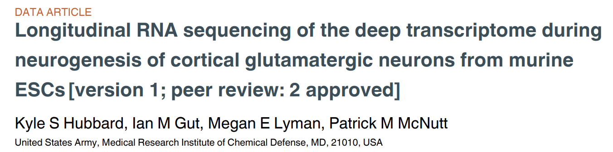
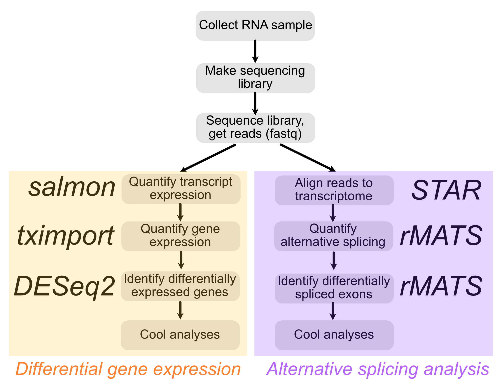
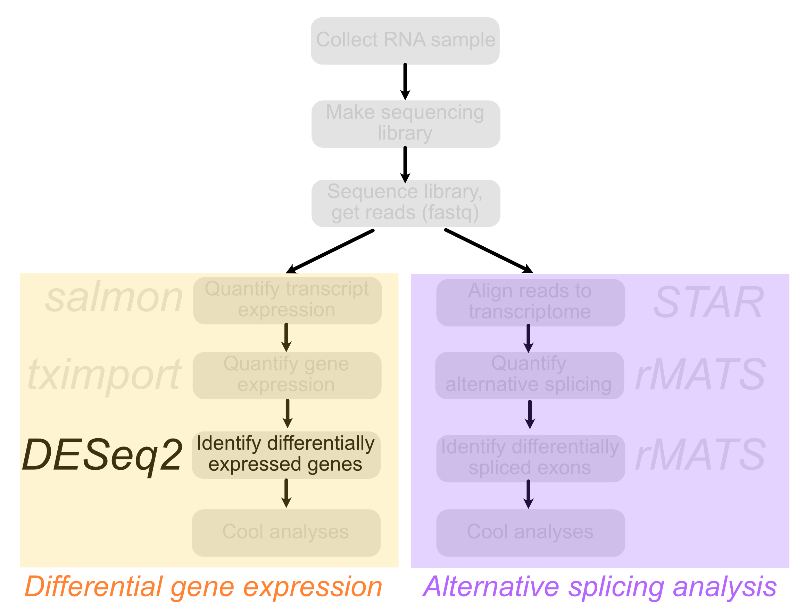

```{r run-setup---dont-delete, child = "slide-setup.Rmd"}
```

layout: true

<div class="my-footer">
  <span>
  Matthew Taliaferro | RNAseq: Differential Expression | <a href="https://molb7950.netlify.app/">MOLB 7950 website</a>
  </span>
</div> 

---

# Contact Info 

### Greetings experimentalist humans `r emo::ji("wave")`

<i class="fa fa-envelope"></i> &nbsp; [matthew.taliaferro@cuanschutz.edu](mailto:matthew.taliaferro@cuanschutz.edu) <br>

---
class: highlight-last-item

# Learning Objectives

###By the end of the class, you should be able to:

- Identify genes that are differentially expressed between two samples using `DESeq2`

--
- Explore differential expression results qualitatively

--
- Plot the expression of single genes across conditions

--
- Investigate changes in expression for groups of genes based on their membership within gene ontology categories


---

# Rigor & Reproducibility

.pull-left[As with all computational **experiments** (yes, they are experiments, don't let your pipette-toting friends tell you otherwise), keeping track of what you did is key. In the old days, I kept a written notebook of commands that I ran.  Sounds silly, but there were many times that I went back to that notebook to see exactly what the parameters were for a given run using a piece of software.

Today, there are better options. You are using one of the better ones right now.  Notebooks, including RMarkdown (mainly for R) and Jupyter (mainly for Python), are a great way to keep track of what you did as well as give justification or explanation for your analyses using plain 'ol English.


Trust me, one day you will be glad you used them. The Methods section of your paper is never fun to write without them.]

.pull-right[.center[
```{r echo = FALSE, out.width = '35%'}
library(tidyverse)
library(tximport)
library(DESeq2)
library(knitr)
library(biomaRt)

```
]

.center[
```{r echo = FALSE, out.width = '35%'}
knitr::include_graphics('img/jupyter.png')
```
]]


---
class: highlight-last-item

# Problem Set and Grading Rubric

Today's problem set is composed of 3 problems. The first one is worth 30% of the total points while the next two are worth 35% each.  For all of these problems, you will be presented with an RNAseq dataset. Transcript quantification will have already been performed using `salmon`, and differential expression analysis will have been performed with `DESeq2`. 

--
- In the first, you must take those results and plot the expression of a single gene across two different conditions.

--
- In the second, you will ask for differences in expression in a *group* of genes across two conditions.

--
- In the third, you will plot differences in expression for a group of genes to identify those that are differentially expressed.


---

# Further reading

If you are interested, here is a little more information about today's topic that you can read later:

.pull-left[ 
- A [vignette](http://bioconductor.org/packages/devel/bioc/vignettes/DESeq2/inst/doc/DESeq2.html) describing the use of `DESeq2`
- The [paper](https://genomebiology.biomedcentral.com/articles/10.1186/s13059-014-0550-8) describing `DESeq2`'s method
]

---

# Overview

In this class, we will examine RNAseq data collected over a timecourse of differentiation from mouse embryonic stem cells to cortical glutamatergic neurons [(Hubbard et al, F1000 Research (2013))](10.12688/f1000research.2-35.v1). In this publication, the authors differentiated mESCs to neurons using a series of *in vitro* culture steps over a period of 37 days. During this timecourse, samples were extracted at selected intervals for transcriptome analysis. Importantly, for each timepoint, either 3 or 4 samples were taken for RNA extraction, library preparation and sequencing.  This allows us to efficiently use the statistical frameworks provided by the [DESeq2](http://bioconductor.org/packages/devel/bioc/vignettes/DESeq2/inst/doc/DESeq2.html) package to identify genes whose RNA expression changes across the timecourse.


```{r echo = FALSE, out.width = '120%'}

```


---

# Overview

.pull-left[Cells were grown in generic differentiation-promoting media (LIF-) for 8 days until aggreates were dissociated and replated in neuronal differentiation media. This day of replating was designated as *in vitro* day 0 (DIV0).  The timepoints taken before this replating therefore happened at "negative" times (DIV-8 and DIV-4). Because naming files with dashes or minus signs can cause problems, these samples are referred to as DIVminus8 and DIVminus4. Following the replating, samples were taken at days 1, 7, 16, 21, and 28 (DIV1, DIV7, DIV16, DIV21, and DIV28).

Today we will focus on identifying .hotpink[differentially expressed genes] between two of these timepoints.
] 

.pull-right[
```{r echo = FALSE, out.width = '100%'}

```
]

---

#Overview

.pull-left[Cells were grown in generic differentiation-promoting media (LIF-) for 8 days until aggreates were dissociated and replated in neuronal differentiation media. This day of replating was designated as *in vitro* day 0 (DIV0).  The timepoints taken before this replating therefore happened at "negative" times (DIV-8 and DIV-4). Because naming files with dashes or minus signs can cause problems, these samples are referred to as DIVminus8 and DIVminus4. Following the replating, samples were taken at days 1, 7, 16, 21, and 28 (DIV1, DIV7, DIV16, DIV21, and DIV28).

Today we will focus on identifying .hotpink[differentially expressed genes] between two of these timepoints.
] 

.pull-right[
```{r echo = FALSE, out.width = '100%'}

```
]

---

# Overview

Last time we took RNAseq data from an *in vitro* differentiation timecouse from mouse ESCs to glutaminergic neurons [(Hubbard et al, F1000 Research (2013))](10.12688/f1000research.2-35.v1). We took in transcript-level quantifications produced by `salmon` and collapsed them to gene-level quantifications using `tximport`. We then inspected the quality of the data by relating distances between samples using two methods: .hotpink[hierarchical clustering] and .hotpink[principal components analysis]. 

We found that the data was of high quality, as evidenced by the fact that replicates from a given timepoint were highly similar to other replicates for the same timepoint, and the distances between samples made sense with what we know about how the experiment was conducted.

--

Today, we are going to pretend that this isn't a timecourse.  We are going to imagine that we have only two conditions: the .blue[first timepoint (DIVminus8)] and the .orange[last timepoint (DIV28)]. We will use `DESeq2` to identify genes that are differentially expressed between these two timepoints.  

We will then plot changes in expression for both individual genes and groups of genes that we already know going in might be interesting to look at. Finally, we will look at some features of transcripts and genes that are differentially expressed between these two timepoints.  We are not doing this two-timepoint comparsion because it is necessarily a good thing to do with timepoint data. Instead, we are doing this because often in an RNAseq experiment, you only have two conditions to compare.

---

# Identifying differentially expressed genes with DESeq2

The first thing we need to do is read in the data again and move from transcript-level expression values to gene-level expression values with `tximport`. Let's use `biomaRt` to get a table that relates gene and transcript IDs.

.code[
```{r gett2g}
mart <- biomaRt::useMart("ENSEMBL_MART_ENSEMBL", dataset = "mmusculus_gene_ensembl", host='www.ensembl.org')
t2g <- biomaRt::getBM(attributes = c('ensembl_transcript_id', 'ensembl_gene_id', 'external_gene_name'), mart = mart)
```
]

---

# Quantify gene expression with `tximport`

Now we can read in the transcript-level data and collapse to gene-level data with `tximport`

.code[
```{r maketxi}
#The directory where all of the sample-specific salmon subdirectories live
base_dir <- 'data/salmonouts/'

#The names of all the sample-specific salmon subdirectories
sample_ids <- c('DIV0.Rep1', 'DIV0.Rep2', 'DIV0.Rep3',
                'DIV7.Rep1', 'DIV7.Rep2', 'DIV7.Rep3', 'DIV7.Rep4')

#So what we want to do now is create paths to each quant.sf file that is in each sample_id.
#This can be done by combining the base_dir, each sample_id directory, and 'quant.sf'
#For example, the path to the first file will be 
#data/salmonouts/DIVminus8.Rep1/quant.sf
salm_dirs <- sapply(sample_ids, function(id) file.path(base_dir, id, 'quant.sf'))

#Run tximport
txi <- tximport(salm_dirs, type = 'salmon', tx2gene = t2g, dropInfReps = TRUE, countsFromAbundance = 'lengthScaledTPM')
```
]

---

# Quantify gene expression with `tximport`

Let's take a look at what `tximport` did just to make sure everything is `r emo::ji("100")`

.code[
```{r lookattxi, eval = FALSE}
kable(txi$abundance[1:20,])
```
]

--

.scroll-box-16[
.plot[
```{r lookattxi-out, ref.label='lookattxi', echo = FALSE}
```
]
]

---

# Identifying differentially expressed genes with DESeq2

OK we are going to need to give `DESeq2` information about the samples like which sample belongs to which timepoint.

--

```{r makesampledf, eval = FALSE}
samples <- data.frame(row.names = c('DIV0.Rep1', 'DIV0.Rep2', 'DIV0.Rep3',
                                    'DIV7.Rep1', 'DIV7.Rep2', 'DIV7.Rep3', 'DIV7.Rep4'),
                      timepoint = c(rep('DIV0', 3), rep('DIV7', 4)))

samples
```

--

.plot[
```{r makesampledf-out, ref.label='makesampledf', echo = FALSE}
```
]

---

# Design formulae

There are essentially two steps to using `DESeq2`. The first involves creating a `DESeqDataSet` from your data. Luckily, if you have a `tximport` object, which we do in the form of `txi`, then this becomes easy.

```{r makeddsTxi, eval=FALSE}
ddsTxi <- DESeqDataSetFromTximport(txi, colData = samples, design = ~ timepoint)
```

--

You can see that `DESeqDataSetFromTximport` wants three things. The **first** is our `tximport` object. The **second** is the dataframe we made that relates samples and conditions (or in this case timepoints). The **last** is something called a .hotpink[*design formula*]. A design formula contains all of the variables that will go into `DESeq2`'s model. The formula starts with a tilde and then has variables separated by a plus sign. It is common practice, and in fact basically required with `DESeq2`, to put the variable of interest last.  In our case, that's trivial because we only have one: .orange[timepoint]. So our design formula is very simple:

```{r design1, eval=FALSE}
design = ~ timepoint
```
    
---

# Design formulae

Your design formula should ideally include **all of the sources of variation in your data**.  For example, let's say that here we thought there was a batch effect with the .blue[replicates].  Maybe all of the Rep1 samples were prepped and sequenced on a different day than the Rep2 samples and so on. We could potentially account for this in `DESeq2`'s model with the following formula:

```{r design2, eval=FALSE}
design = ~ replicate + timepoint
```
    
--

Here, .orange[timepoint] is still the variable of interest, but we are controlling for differences that arise due to differences in .blue[replicates]. Of course, this formula would require us to go back and make a new `samples` table that included 'replicate' as a factor.

---

# Making a DESeq dataset

OK so let's go ahead and make our dataset with `DESeq2`.

.code[
```{r lookatddstxi, eval = FALSE}
ddsTxi <- DESeqDataSetFromTximport(txi, colData = samples, design = ~ timepoint)

ddsTxi
```
]

--

.plot[
```{r lookatddstxi-out, ref.label='lookatddstxi', echo = FALSE}
```
]

--

We can see here that `DESeq2` is taking the .hotpink[.big[counts]] produced by `tximport` for gene quantifications. There are 52346 .orange[genes] (rows) here and 8 .blue[samples] (columns). We learned earlier that `DESeq2` uses .hotpink[counts], not TPM, not FPKM, not anything else, when identifying differentially expressed genes. This is very important for `DESeq2`'s statistical model. We won't say much more about this here or get into the guts of `DESeq2`, instead focusing on running it. Although we have mainly looked at their TPM outputs thus far, `salmon` also quantifies .hotpink[counts] for every transcript, and `tximport` will collate them to gene-level .hotpink[count] measurements. That's what `DESeqDataSetFromTximport` is using here.

---

# Running `DESeq2`

Now using this ddsTxi object, we can run `DESeq2`. Let's do it.

.code[
```{r rundeseq, eval = TRUE}
dds <- DESeq(ddsTxi)
```
]

--

There are many useful things in this `dds` object.  I encourage you to take a look at the [vignette](http://bioconductor.org/packages/devel/bioc/vignettes/DESeq2/inst/doc/DESeq2.html) for `DESeq2` for a full explanation about what is in there, as well as info on many more tests and analyses that can be done with `DESeq2`.

---

# Accessing results

The results can be accessed using the aptly named `results()` function.

We are going to include the `contrast` argument here. `DESeq2` reports changes in RNA abundance between two samples as a log2FoldChange. That's great, but it's often not clear exactly what the .hotpink[numerator] and .hotpink[denominator] of that fold change ratio is. In this case, it could be either DIV28/DIVminus8 or DIVminus8/DIV28.

--

In actuality, it's of course not random. The alphabetically first condition will be the .hotpink[numerator]. Still, I find it less confusing to explicitly specify what the .hotpink[numerator] and .hotpink[denominator] of this ratio are using the `contrast` argument.

--

.code[
```{r contrast1, eval = FALSE}
#For contrast, we give three strings: the factor we are interested in, 
#the numerator, and the denominator
#It makes the most sense (to me at least) to have DIV28 be the numerator
results(dds, contrast = c('timepoint', 'DIV7', 'DIV0'))
```
]

---

# Accessing results

Another useful application of the `contrast` argument can be seen with more complicated design formulae.  Remember our design formula that accounted for potential differences due to replicate batch effects:

--

.code[
```{r formula3, eval = FALSE}
design = ~ replicate + timepoint
```
]

--

As we said before, with this formula, `DESeq2` will account for differences between .blue[replicates] here to find differences between .orange[timepoints]. However, what if we wanted to look at differences between .blue[replicate] batches?  By supplying '.blue[replicate]' to `contrast` instead of '.orange[timepoint]', we could extract difference between these batches.

---

# Accessing results

OK, back to what we were doing.  Let's take a look at what `results()` will give us.

--

.code[
```{r resultsagain, eval = FALSE}
#For contrast, we give three strings: the factor we are interested in, 
#the numerator, and the denominator
#It makes the most sense (to me at least) to have DIV28 be the numerator
results(dds, contrast = c('timepoint', 'DIV7', 'DIV0'))
```
]

--

.plot[
```{r resultsagain-out, ref.label='resultsagain', echo = FALSE}
```
]

---

# Accessing results
We can see here that this is a dataframe where the rows are genes and the columns are interesting data.
The columns we are most interested in are .hotpink[log2FoldChange] and .hotpink[padj].
.hotpink[log2FoldChange] is self-explanatory. .hotpink[padj] is the pvalue for a test asking if the expression of this gene is different between the two conditions. This pvalue has been corrected for multiple hypothesis testing using the Benjamini-Hochberg method.

Let's do a little work on this dataframe to make it slightly cleaner and more informative.

.pull-left[
.scroll-box-18[
.code[
```{r makeresultstable, eval = FALSE}
differentiation.results <- results(dds, contrast = c('timepoint', 'DIV7', 'DIV0')) %>%
  #Change this into a dataframe
  as.data.frame(.) %>%
  #Move ensembl gene IDs into their own column
  rownames_to_column(., var = 'ensembl_gene_id') %>%
  #Get rid of columns that are so useful to us right now
  dplyr::select(., -c(baseMean, lfcSE, stat, pvalue)) %>%
  #Merge this with a table relating ensembl_gene_id with gene short names
  inner_join(unique(dplyr::select(t2g, -ensembl_transcript_id)), ., by = 'ensembl_gene_id') %>%
  #Rename external_gene_name column
  dplyr::rename(., Gene = external_gene_name)

kable(differentiation.results[1:20,])
```
]
]
]

--

.pull-right[
.scroll-box-16[
.plot[
```{r makeresultstable-out, ref.label='makeresultstable', echo = FALSE}
```
]
]
]

---

# Identifying differentially expressed genes

OK now we have a table of gene expression results. How many genes are significantly .orange[up]/.blue[down] regulated between these two timepoints?
We will use 0.01 as an FDR (p.adj) cutoff.

.code[
```{r numberofdegenes, eval=FALSE}
#number of upregulated genes
nrow(filter(differentiation.results, padj < 0.01 & log2FoldChange > 0))
#number of downregulated genes
nrow(filter(differentiation.results, padj < 0.01 & log2FoldChange < 0))
```
]

--

.plot[
```{r numberofdegenes-out, ref.label='numberofdegenes', echo = FALSE}
```
]

---

# Identifying differentially expressed genes
Let's make a volcano plot of these results.

.pull-left[
.scroll-box-18[
.code[
```{r DEvolcano, eval = FALSE}
#We are going to add an extra column to differentiation.results t
#hat tells us whether or not a gene 
#meets the FDR cutoff
differentiation.results.sig <- mutate(differentiation.results, 
                                      sig = ifelse(padj < 0.01, 'yes', 'no')) %>%
  #if a gene did not meet expression cutoffs that DESeq2 
  #automatically does, it gets a pvalue of NA
  na.omit(.)

ggplot(differentiation.results.sig, 
       aes(x = log2FoldChange, y = -log10(padj), color = sig)) + 
  geom_point(alpha = 0.2) + 
  xlab('DIV7 expression / DIV0 expression, log2') + 
  ylab('-log10(FDR)') + theme_classic(16) +
  scale_color_manual(values = c('gray', 'red'), 
                     labels = c('NS', 'FDR < 0.01'), name = '') +
  theme(legend.position = c(0.8, 0.5)) + 
  guides(color = guide_legend(override.aes = list(alpha = 1)))
```
]
]
]

--

.pull-right[
.plot[
```{r DEvolcano-out, ref.label='DEvolcano', echo = FALSE}
```
]
]

---

#Adding a log2FC threshold

OK that's a lot of significant genes. What if, in addition to an FDR cutoff, we applied a .hotpink[log2FoldChange cutoff]?
We can do this by asking for p values that incorporate the probability that the log2FoldChange was greater than a threshold.
This will of course be more conservative, but will probably give you a more confident set of genes.

.code[
```{r lfcresults, eval = TRUE}
#Is the expression of the gene at least 3-fold different?
differentiation.results.lfc <- results(dds, contrast = c('timepoint', 'DIV7', 'DIV0'), 
                                       lfcThreshold = log(3, 2)) %>%
  #Change this into a dataframe
  as.data.frame(.) %>%
  #Move ensembl gene IDs into their own column
  rownames_to_column(., var = 'ensembl_gene_id') %>%
  #Get rid of columns that are so useful to us right now
  dplyr::select(., -c(baseMean, lfcSE, stat, pvalue)) %>%
  #Merge this with a table relating ensembl_gene_id with gene short names
  inner_join(unique(dplyr::select(t2g, -ensembl_transcript_id)), ., by = 'ensembl_gene_id') %>%
  #Rename external_gene_name column
  dplyr::rename(., Gene = external_gene_name) %>%
  mutate(., sig = ifelse(padj < 0.01, 'yes', 'no')) %>%
  na.omit(.)
```
]

---

#Adding a log2FC threshold

As before, we can see the number of genes that are signficiantly .orange[up]/.blue[down] regulated between these two timepoints. This time, p values represent genes that we are confident are at least 3-fold .orange[up] or .blue[down] regulated.

.code[
```{r numberofdegenes_3fold, eval=FALSE}
#number of upregulated genes
nrow(filter(differentiation.results.lfc, padj < 0.01 & log2FoldChange > 0))
#number of downregulated genes
nrow(filter(differentiation.results.lfc, padj < 0.01 & log2FoldChange < 0))
```
]

--

.plot[
```{r numberofdegenes_3fold-out, ref.label='numberofdegenes_3fold', echo = FALSE}
```
]

---

#Adding a log2FC threshold

.pull-left[
.scroll-box-14[
.code[
```{r DEvolcano_3fold, eval = FALSE}
ggplot(differentiation.results.lfc, aes(x = log2FoldChange, y = -log10(padj), color = sig)) + 
  geom_point(alpha = 0.2) + 
  xlab('DIV7 expression / DIV0 expression, log2') + 
  ylab('-log10(FDR)') + theme_classic(16) +
  scale_color_manual(values = c('gray', 'red'), 
                     labels = c('NS', 'FDR < 0.01'), name = '') +
  theme(legend.position = c(0.8, 0.5)) + 
  guides(color = guide_legend(override.aes = list(alpha = 1)))
```
]
]
]

--

.pull-right[
.plot[
```{r DEvolcano_3fold-out, ref.label='DEvolcano_3fold', echo = FALSE}
```
]
]

--

Again, fewer genes, but we can probably be more confident in them.

---

# Plotting the expression of single genes

Sometimes we will have particular marker genes that we might want to highlight to give confidence that the experiment worked as expected.  We can plot the expression of these genes in each replicate. For this case, let's plot the expression of two .blue[pluripotency] genes (which we expect to .blue[decrease]) and two strongly .orange[neuronal] genes (which we expect to .orange[increase]).

--

So what is the value that we would plot? Probably the most correct value is the 'normalized counts' value provided by `DESeq2`. This value is the safest to compare across samples within a gene.  These counts are raw counts that have been normalized for sequencing depth and sample composition. However, I find that it is difficult to quickly get a sense of the expression level of a gene from it's number of normalized counts.  

--

Let's say a gene had 500 normalized counts. Is that a .orange[highly] expressed gene? A .blue[lowly] expressed gene? Well, I won't really know unless I knew the length of the gene, and I don't have the length of every gene memorized.

--

A more interpretable value to plot might be TPM, since TPM is length-normalized.  Let's say a gene was expressed at 500 TPM. Right off the bat, I know generally what kind of expression that reflects (pretty .orange[high]).

--

.code[
```{r normcounts, eval = FALSE}
#If you are interested in getting normalized counts, here's how you do it
normcounts <- counts(dds, normalized = TRUE)
```
]

---

# Plotting the expression of single genes

Let's plot the expression of .blue[Klf4], .blue[Sox2], .orange[Bdnf], and .orange[Dlg4] in our samples.

--

.code[
```{r singlegenetpms, eval = FALSE}
#Get a table of tpms...remember txi is our tximport object
tpms <- txi$abundance %>%
  as.data.frame(.) %>%
  rownames_to_column(., var = 'ensembl_gene_id') %>%
  inner_join(unique(dplyr::select(t2g, -ensembl_transcript_id)), ., by = 'ensembl_gene_id') %>%
  dplyr::rename(., Gene = external_gene_name) %>%
  #Filter for genes we are interested in
  filter(., Gene %in% c('Klf4', 'Sox2', 'Bdnf', 'Dlg4'))

kable(tpms[1:4,])
```
]

--

.plot[
```{r singlegenetpms-out, ref.label='singlegenetpms', echo = FALSE}
```
]

---

# Plotting the expression of single genes

OK, this is close to what we want, but in order to plot it we need to turn it from a wide table into a long table.

.code[
```{r gathersinglegenetpms, eval = FALSE}
#Key is the new 'naming' variable
#Value is the new 'value' variable
#At the end we give it the columns that contain the values
#we want to reshape
tpms <- gather(tpms, key = sample, value = tpm, DIV0.Rep1:DIV7.Rep4)
kable(tpms)
```
]

--

.scroll-box-14[
.plot[
```{r gathersinglegenetpms-out, ref.label='gathersinglegenetpms', echo = FALSE}
```
]
]

---

# Plotting the expression of single genes

Now add one more column that tells which condition each replicate belongs to.

.code[
```{r gathersinglegenetpms_addcol, eval = FALSE}
tpms <- mutate(tpms, condition = ifelse(grepl('DIV0', sample), 'DIV0', 'DIV7'))
kable(tpms)
```
]

--

.scroll-box-14[
.plot[
```{r gathersinglegenetpms_addcol-out, ref.label='gathersinglegenetpms_addcol', echo = FALSE}
```
]
]

---

# Plotting the expression of single genes

Now let's plot. 
Remember, we are expecting our .blue[pluripotency] genes (.blue[Klf4] and .blue[Sox2]) to go down while our .orange[neuron]-specific genes (.orange[Bdnf] and .orange[Dlg4]) should go up. 

.pull-left[
.code[
```{r plotsingletpms, eval = FALSE}
ggplot(tpms, aes(x = condition, y = tpm, color = condition)) + 
  geom_point(pch = 21, size = 4) + 
  ylab('TPM') + xlab('') + theme_classic(16) + 
  scale_color_manual(values = c('blue', 'red'), guide = F) +
  facet_wrap(~Gene, scales = 'free_y')
```
]
]

--

.plot[
```{r plotsingletpms-out, ref.label='plotsingletpms', echo = FALSE}
```
]

---

#Plotting the expression of groups of genes

OK, that's cool and all, but let's do something a little bigger. Say that instead of plotting individual genes we wanted to ask whether a whole class of genes are going .orange[up] or .blue[down].  We can do that by retrieving all genes that belong to a particular gene ontology term.

There are three classes of genes we will look at here: 
 - Maintenance of pluripotency (GO:0019827)
 - Positive regulation of the cell cycle (GO:0045787)
 - Neuronal differentitaion (GO:0030182)
 
--

So the idea here is to ask if the genes that belong to these categories behave differently than genes not in the category.

---

#Plotting the expression of groups of genes

We can use `biomaRt` to get all genes that belong to each of these categories.  Think of it like doing a gene ontology enrichment analysis in reverse.

.pull-left[
.scroll-box-14[
.code[
```{r getGOgroups, eval=FALSE}
pluripotencygenes <- getBM(attributes = c('ensembl_gene_id'), 
                           filters = c('go_parent_term'), 
                           values = c('GO:0019827'), 
                           mart = mart)

cellcyclegenes <- getBM(attributes = c('ensembl_gene_id'), 
                        filters = c('go_parent_term'), 
                        values = c('GO:0045787'), 
                        mart = mart)

neurongenes <- getBM(attributes = c('ensembl_gene_id'), 
                     filters = c('go_parent_term'), 
                     values = c('GO:0030182'), 
                     mart = mart)

head(pluripotencygenes)
```
]
]
]

--

.pull-right[
.scroll-box-14[
.plot[
```{r getGOgroups-out, ref.label='getGOgroups', echo = FALSE}
```
]
]
]

--

You can see that these items are one-column dataframes that have the column name 'ensembl_gene_id'.  We can now go through our results dataframe and add an annotation column that marks whether the gene is in any of these categories.

---

#Plotting the expression of groups of genes

.code[
.scroll-box-10[
```{r addGOannot, eval=FALSE}
differentiation.results.annot <- differentiation.results %>%
  mutate(., annot = case_when(ensembl_gene_id %in% pluripotencygenes$ensembl_gene_id ~ 'pluripotency',
                      ensembl_gene_id %in% cellcyclegenes$ensembl_gene_id ~ 'cellcycle',
                      ensembl_gene_id %in% neurongenes$ensembl_gene_id ~ 'neurondiff',
                      TRUE ~ 'none'))

#Reorder these for plotting purposes
differentiation.results.annot$annot <- factor(differentiation.results.annot$annot, 
                                              levels = c('none', 'cellcycle', 'pluripotency', 'neurondiff'))

kable(differentiation.results.annot[1:20,])
```
]
]
--

.scroll-box-10[
.plot[
```{r addGOannot-out, ref.label='addGOannot', echo = FALSE}
```
]
]

---

#Plotting the expression of groups of genes

OK we've got our table, now we are going to ask if the log2FoldChange values for the genes in each of these classes are different that what we would expect.  So what is the expected value?  Well, we have a distribution of log2 fold changes for all the genes that are .red[*not*] in any of these categories.  So we will ask if the distribution of log2 fold changes for each gene category is different than that null distribution.

--

You can tie yourself in knots worrying about what is the right test to use for a lot of these things. What are the assumptions of the test? Does my data fit these assumptions?  Is it normally distributed? My advice is to pretty much always just use rank-based nonparametric tests.  Yes, you will sacrifice some power, meaning that your *p* values will generally be higher than those produced by parametric tests that make assumptions.  However, in genomics, we often have many observations of something or many members in our groups. So if your *p* value is borderline where the choice of test makes a big difference, I'm already a little skeptical.

---

#Wilcoxon rank sum test

For each GO group, use a .hotpink[Wilcoxon rank sum] test to ask if the log2FoldChange values for genes .orange[within] the group are different from the log2FoldChange values for genes .blue[outside of] the group.

--

.code[
```{r GOwilcoxon, eval=TRUE}
#Compare log2FC values for pluripotency genes and other genes
p.pluripotency <- wilcox.test(filter(differentiation.results.annot, annot == 'pluripotency')$log2FoldChange,
                              filter(differentiation.results.annot, annot == 'none')$log2FoldChange)$p.value

#Only 2 significant digits for the p value, s'il vous plait
p.pluripotency <- signif(p.pluripotency, 2)

p.cellcycle <- wilcox.test(filter(differentiation.results.annot, annot == 'cellcycle')$log2FoldChange,
                              filter(differentiation.results.annot, annot == 'none')$log2FoldChange)$p.value
p.cellcycle <- signif(p.cellcycle, 2)

p.neurondiff <- wilcox.test(filter(differentiation.results.annot, annot == 'neurondiff')$log2FoldChange,
                              filter(differentiation.results.annot, annot == 'none')$log2FoldChange)$p.value
p.neurondiff <- signif(p.neurondiff, 2)
```
]

> Note: Astute viewers may notice that we are not comparing every gene .orange[within] a category to all genes .blue[outside] of it. We are comparing all genes .orange[within] a category to genes that are not in *any* category. This is a reasonable approximation for all genes since most genes aren't in any of these three categories.

---

#Plot results

.pull-left[
.scroll-box-18[
.code[
```{r plotGO, eval = FALSE}
ggplot(differentiation.results.annot, aes(x = annot, y = log2FoldChange, color = annot)) +
  xlab('Gene class') + ylab('DIV7 expression / DIV0 expression, log2') +
  #Make gray dotted line at y=0
  geom_hline(yintercept = 0, color = 'gray', linetype = 'dashed') +
  #Boxplot to compare distributions
  geom_boxplot(notch = TRUE, outlier.shape = NA) +
  #Set colors manually
  theme_classic(14) + scale_color_manual(values = c('gray', 'red', 'blue', 'purple'), guide = F) +
  #Label x values
  scale_x_discrete(labels = c('none', 'Cell cycle', 'Pluripotency', 'Neuron\ndifferentiation')) +
  #Set plot yvalue limits
  coord_cartesian(ylim = c(-5, 8)) +
  #Draw lines over samples
  annotate('segment', x = 1, xend = 2, y = 4, yend = 4) +
  annotate('segment', x = 1, xend = 3, y = 5, yend = 5) +
  annotate('segment', x = 1, xend = 4, y = 6, yend = 6) +
  #Add pvalue results
  annotate('text', x = 1.5, y = 4.4, label = paste0('p = ', p.cellcycle)) +
  annotate('text', x = 2, y = 5.4, label = paste0('p = ', p.pluripotency)) +
  annotate('text', x = 2.5, y = 6.4, label = paste0('p = ', p.neurondiff))
```
]
]
]

--

.pull-right[
.plot[
```{r plotGO-out, ref.label='plotGO', echo = FALSE}
```
]
]
