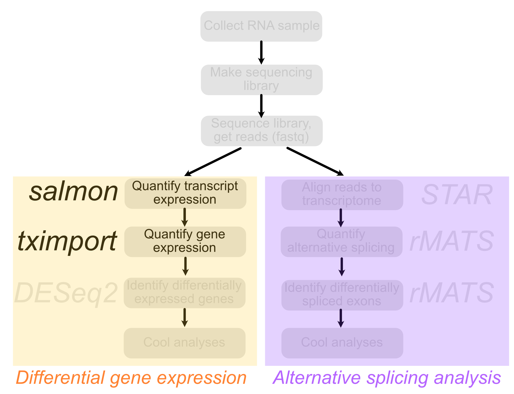
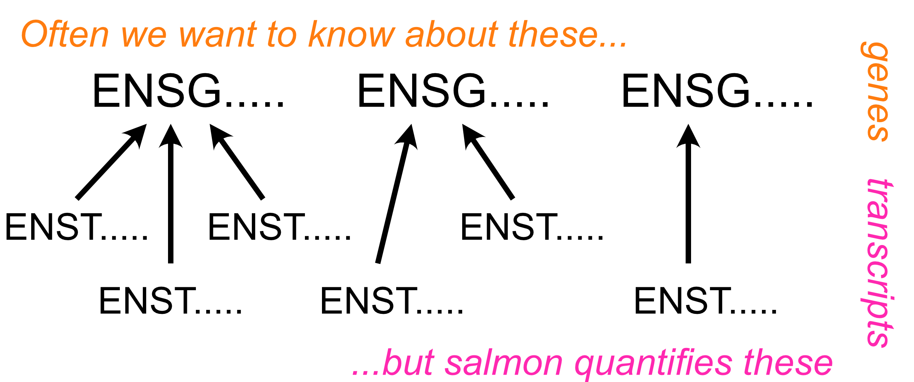
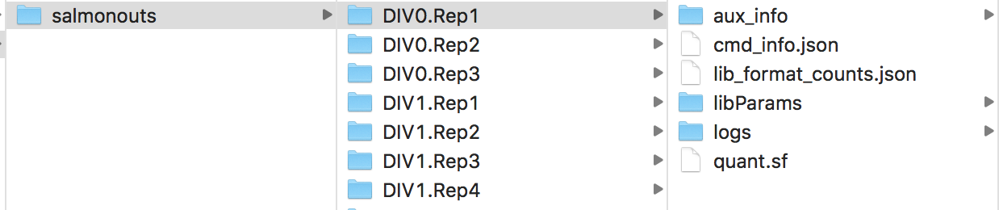

```{r run-setup---dont-delete, child = "slide-setup.Rmd"}
```

layout: true

<div class="my-footer">
  <span>
  Matthew Taliaferro | RNAseq: Quality Control | <a href="https://molb7950.netlify.app/">MOLB 7950 website</a>
  </span>
</div> 

---
background-color: #000000
.center[

.lightblue[
.big[
.middle[
Not that long ago in 

a lab not so far away...
]
]
]
]

---

background-color: #000000
color: #FFFF00

.titles[
.titlecontent[
.yellow[
.center[

BLOCK IV: RNASEQ

There have been trying times in MOLB 7950.

INSTRUCTORS have been bombarding students with code and strategies for studying DNA and genome sequences. 

These genomic padawans have become overwhelmed by the nucleic acid from the DARK SIDE. Their hope for interesting scientific questions has begun to dim.

On the horizon, A NEW HOPE emerges. A nucleic acid that is not burdened by the lack of a 2' hydroxyl. A hero that has harnessed the power of URACIL. A molecule that is dynamic and whose importance for all of biology is recently being appreciated.

A new block begins that is focused on this molecule and its immense promise...

]
]
]
]


---

# Contact Info 

<iframe width="0" height="0" src="https://www.youtube.com/embed/fBJ2WyYP2uU?&autoplay=1&start=1&end=89" frameborder="0" allow="autoplay"></iframe>

### Greetings experimentalist humans `r emo::ji("wave")`

<i class="fa fa-envelope"></i> &nbsp; [matthew.taliaferro@cuanschutz.edu](mailto:matthew.taliaferro@cuanschutz.edu) <br>

---
class: highlight-last-item

# Learning Objectives

###By the end of the class, you should be able to:

- Understand how `salmon` can be used to quantify gene expression given an RNAseq dataset

--
- Collapse transcript-level quantifications to gene level quantifications using `tximport`

--
- Deduce the relationships of samples to each other using hierarchical clustering and PCA 


---

# Rigor & Reproducibility

.pull-left[As with all computational **experiments** (yes, they are experiments, don't let your pipette-toting friends tell you otherwise), keeping track of what you did is key. In the old days, I kept a written notebook of commands that I ran.  Sounds silly, but there were many times that I went back to that notebook to see exactly what the parameters were for a given run using a piece of software.

Today, there are better options. You are using one of the better ones right now.  Notebooks, including RMarkdown (mainly for R) and Jupyter (mainly for Python), are a great way to keep track of what you did as well as give justification or explanation for your analyses using plain 'ol English.


Trust me, one day you will be glad you used them. The Methods section of your paper is never fun to write without them.]

.pull-right[.center[
```{r echo = FALSE, out.width = '35%'}
knitr::include_graphics('img/Rmarkdown.jpg')
```
]

.center[
```{r echo = FALSE, out.width = '35%'}
knitr::include_graphics('img/jupyter.png')
```
]]


---
class: highlight-last-item

# Problem Set and Grading Rubric

Today's problem set is composed of 2 problems. Each of them is worth 50% of the total points.  For both of these problems, you will be presented with an RNAseq dataset. Transcript quantification will have already been performed using `salmon`. 

--
- In the first, you must take those transcript-level quantifications and convert them to gene-level quantifcations using `tximport`. You will then filter genes based on whether or not they meet an expression level cutoff in all samples and then determine relationships between samples using hierarchical clustering.

--
- In the second, you will take the same dataset and determine relationships between samples using PCA.


---

# Further reading

If you are interested, here is a little more information about today's topic that you can read later:

.pull-left[ 
- The [paper](https://www.ncbi.nlm.nih.gov/pmc/articles/PMC5600148/) describing `salmon` and its approach to transcriptome quantification
- The [documentation](https://combine-lab.github.io/salmon/) for `salmon`
- The [documentation](https://bioconductor.org/packages/release/bioc/vignettes/tximport/inst/doc/tximport.html) for `tximport`
]

---

# Overview

In this class, we will examine RNAseq data collected over a timecourse of differentiation from mouse embryonic stem cells to cortical glutamatergic neurons [(Hubbard et al, F1000 Research (2013))](10.12688/f1000research.2-35.v1). In this publication, the authors differentiated mESCs to neurons using a series of *in vitro* culture steps over a period of 37 days. During this timecourse, samples were extracted at selected intervals for transcriptome analysis. Importantly, for each timepoint, either 3 or 4 samples were taken for RNA extraction, library preparation and sequencing.  This allows us to efficiently use the statistical frameworks provided by the [DESeq2](http://bioconductor.org/packages/devel/bioc/vignettes/DESeq2/inst/doc/DESeq2.html) package to identify genes whose RNA expression changes across the timecourse.


```{r echo = FALSE, out.width = '120%'}
knitr::include_graphics('img/RNAseqpaper.png')
```


---

# Overview

.pull-left[Cells were grown in generic differentiation-promoting media (LIF-) for 8 days until aggreates were dissociated and replated in neuronal differentiation media. This day of replating was designated as *in vitro* day 0 (DIV0).  The timepoints taken before this replating therefore happened at "negative" times (DIV-8 and DIV-4). Because naming files with dashes or minus signs can cause problems, these samples are referred to as DIVminus8 and DIVminus4. Following the replating, samples were taken at days 1, 7, 16, 21, and 28 (DIV1, DIV7, DIV16, DIV21, and DIV28).

Today we will focus on some .hotpink[Quality Control] steps that are good ideas to do for every RNAseq dataset you encounter, whether produced by yourself or someone else.] 

.pull-right[
```{r echo = FALSE, out.width = '100%'}
knitr::include_graphics('img/flowchart.png')
```
]

---

#Overview

.pull-left[Cells were grown in generic differentiation-promoting media (LIF-) for 8 days until aggreates were dissociated and replated in neuronal differentiation media. This day of replating was designated as *in vitro* day 0 (DIV0).  The timepoints taken before this replating therefore happened at "negative" times (DIV-8 and DIV-4). Because naming files with dashes or minus signs can cause problems, these samples are referred to as DIVminus8 and DIVminus4. Following the replating, samples were taken at days 1, 7, 16, 21, and 28 (DIV1, DIV7, DIV16, DIV21, and DIV28).

Today we will focus on some .hotpink[Quality Control] steps that are good ideas to do for every RNAseq dataset you encounter, whether produced by yourself or someone else.] 

.pull-right[
```{r echo = FALSE, out.width = '100%'}

```
]

---

#Quantifying transcript expression with `salmon`

.pull-left[
We recently learned about the RNAseq quantification tool [salmon](https://combine-lab.github.io/salmon/). We won't rehash the details here about how salmon works. For our purposes, we just need to know that salmon reads in a fastq file of sequencing reads and a fasta file of transcript sequences to be quantified. Let's take a look at this fasta file of transcripts:

.code[
```{bash lookattxfasta, eval = FALSE}
head -n 20 data/gencodecomprehensive.vM17.allcdna.fa
```
]
]

--

.pull-right[
.scroll-box-10[
.plot[
```{bash lookattxfasta-out, ref.label='lookattxfasta', echo = FALSE}
```
]
]
]

--


Looks like we have [ensembl](www.ensembl.org) transcript IDs, which is a good idea. I can tell because they start with 'ENS'. Using ensembl IDs as transcript names will allow us to later collate transcript expression levels into gene expression levels using a database that relates transcripts and genes.  More on that later.


---

#Making a transcriptome index

The first step in quantifying these transcripts is to make an index from them. This is done as follows:

.code[
```{bash makesalmonindex, eval = FALSE}
salmon index -t <transcripts.fa> -i <transcripts.idx> --type quasi -k <k>
```
]
    
--

Here, transcripts.fa is a path to our fasta file, transcripts.idx is the name of the index that will be created, and k is the length of the kmers that will be used in the hash table related kmers and transcripts. k is the length of the minimum accepted match for a kmer in a read and a kmer in a transcript. Longer kmers (higher values of k) will therefore be more stringent, and lowering k may improve mapping sensitivity at the cost of some specificity.  You may also see here how read lengths can influence what value for k you should choose.  

--

Consider an experiment where we had 25 nt reads (this was true wayyyyyy back in the old, dark days of high-throughput sequencing). What's going to happen if I quantify these reads using an index where the kmer size was set to 29?  Well, nothing will align.  The index has represented the transcriptome in 29 nt chunks.  However, no read will match to these 29mers because there are no 29mers in these reads!  *As a general rule of thumb, for reads 75 nt and longer (which is the bulk of the data produced nowadays), a good value for k that maximizes both specificity and sensitivity is 31*.  However, datasets that you may retrieve from the internet, particularly older ones, may have shorter read lengths, so keep this is mind when defining k.

---

#Quantifying reads against this index

Once we have our index, we can quantify transcripts in the index using reads from our fastq files.

.code[
```{bash salmonquant, eval = FALSE}
salmon quant --libType A -p 8 --seqBias --gcBias --validateMappings -1 <forwardreads.fastq> -2 <reversereads.fastq> -o <outputname> --index <transcripts.idx>
```
]
    
In this command, our forward and reverse read fastq files are supplied to -1 and -2, respectively. If the experiment produced single end reads, -2 is omitted. <transcripts.idx> is the path to the index produced in the previous step.  I'm not going to go through the rest of the flags used here, but their meanings as well as other options can be found [here](https://salmon.readthedocs.io/en/latest/salmon.html#using-salmon).

---

#Salmon outputs

Let's take a look at what salmon spits out. The first file we will look at is a log that is found at **/logs/salmon_quant.log**.  This file contains info about the quantification, but there's one line of this file in particular that we are interested in. It lets us know how many of the reads in the fastq file that salmon found a home for in the transcriptome fasta.

--

.code[
```{bash salmonlog, eval = FALSE}
less data/salmonouts/DIV0.Rep1/logs/salmon_quant.log
```
]

--

.plot[
.scroll-box-14[
```{bash salmonlog-out, ref.label='salmonlog', echo = FALSE}
```
]
]

--

There are a lot of lines in this file, but really only one that we are interested in. We want the one that tells us the "Mapping rate."  How could we easily and efficiently look at the mapping rates of all our samples? **Grep!**

---

# Salmon outputs

.code[
```{bash grepmapping, eval = FALSE}
#Get the mapping rates for all samples
#In each log file, the line that we are interested in contains the string 'Mapping ' (notice the space)
grep 'Mapping ' data/salmonouts/*/logs/salmon_quant.log
```
]

--

.plot[
.scroll-box-18[
```{bash grepmapping-out, ref.label='grepmapping', echo = FALSE}
```
]
]

---

#Moving from transcript quantifications to gene quantifications

As we discussed, salmon quantifies .hotpink[*transcripts*], not .orange[*genes*]. However, genes are made up of transcripts, so we can calculate gene expression values from transcript expression values if we knew which transcripts belonged to which genes.

.center[
```{r echo = FALSE, out.width = '78%'}

```
]

---

#Relating genes and transcripts

We can get this relationships between .hotpink[*transcripts*] and .orange[*genes*] through `biomaRt`.

`biomaRt` has many tables that relate genes, transcripts, and other useful data include gene biotypes and gene ontology categories, even across species.  Let's use it here to get a table of genes and transcripts for the mouse genome.

.pull-left[
.code[
```{r listmarts, eval = FALSE}
#Load biomaRt
library(biomaRt)

#First we need to define a 'mart' to use.  
#There are a handful of them that 
#you can see here:
listMarts(mart = NULL, 
          host = 'www.ensembl.org')
```
]
]

--

.pull-right[
.scroll-box-10[
.plot[
```{r listmarts-out, ref.label='listmarts', echo = FALSE}
```
]
]
]

--

I encourage you to see what is in each mart, but for now we are only going to use ENSEMBL_MART_ENSEMBL.
.code[
```{r choosemart, eval = TRUE}
mart <- biomaRt::useMart("ENSEMBL_MART_ENSEMBL", host='www.ensembl.org')
```
]

---

#Using biomaRt

Alright, we've chosen our mart. What datasets are available in this mart?

.pull-left[
.code[
```{r listdatasets, eval = FALSE}
library(knitr)
datasets <- listDatasets(mart)

kable(datasets)
```
]
]

--

.pull-right[
.scroll-box-10[
.plot[
```{r listdatasets-out, ref.label='listdatasets', echo = FALSE}
```
]
]
]

--

.pull-left[
A lot of stuff for a lot of species! Perhaps we want to limit it to see which ones are relevant to mouse.
.code[
```{r mousedatasets, eval = FALSE}
mousedatasets <- filter(datasets, grepl('mmusculus', dataset))
kable(mousedatasets)
```
]
]

--

.pull-right[
.plot[
```{r mousedatasets-out, ref.label='mousedatasets', echo = FALSE}
```
]
]
---

#Using biomaRt

Ah so we probably want the dataset called 'mmusculus_gene_ensembl'!

.code[
```{r definemart, eval = TRUE}
mart <- biomaRt::useMart("ENSEMBL_MART_ENSEMBL", 
                         dataset = "mmusculus_gene_ensembl", host='www.ensembl.org')
```
]

---

#Using biomaRt

OK what goodies are in this dataset?

--


.code[
```{r listAttributes, eval = FALSE}
goodies <- listAttributes(mart)
kable(goodies)
```
]

--

.scroll-box-14[
.plot[
```{r listAttributes-out, ref.label='listAttributes', echo = FALSE}
```
]
]

---

#Using biomaRt

So there are 2885 rows of goodies about the mouse genome and its relationship to *many* other genomes.  However, you can probably see that the ones that are most useful to us right now are right at the top: 'ensembl_transcript_id' and 'ensembl_gene_id'.  We can use those attributes in our mart to make a table relating genes and transcripts.

I'm going to through one more attribute in: external_gene_name. Those are usually more informative than ensembl IDs.

--

.pull-left[
.code[
```{r maket2g, eval = FALSE, warning = FALSE}
t2g <- biomaRt::getBM(attributes = c('ensembl_transcript_id', 'ensembl_gene_id', 'external_gene_name'), mart = mart)
kable(t2g[1:20,])
```
]
]
--

.pull-right[
.plot[
.scroll-box-16[
```{r maket2g-out, ref.label='maket2g', echo = FALSE}
```
]
]
]

---

#Using biomaRt

Alright this looks good! We are going to split this into two tables. One that contains transcript ID and gene ID, and the other that contains gene ID and gene name.

.code[
```{r twotables, eval = TRUE}
geneid2name <- dplyr::select(t2g, c(ensembl_gene_id, ensembl_transcript_id))
t2g <- dplyr::select(t2g, c(ensembl_transcript_id, ensembl_gene_id))
```
]

---

# Getting gene level expression data with `tximport`

Now that we have our table relating transcripts and genes, we can give it to tximport to have it calculate gene-level expression data from our transcript-level expression data.

First, we have to tell it where the salmon quantification files (the quant.sf files) are. Here's what our directory structure that contains these files looks like:

```{r echo = FALSE, out.width = '80%'}

```

---

# Gene expression data with `tximport`

.scroll-box-10[
.code[
```{r makesalmdirs, eval = FALSE}
#The directory where all of the sample-specific salmon subdirectories live
base_dir <- 'data/salmonouts/'

#The names of all the sample-specific salmon subdirectories
sample_ids <- c('DIVminus8.Rep1', 'DIVminus8.Rep2', 'DIVminus8.Rep3', 'DIVminus8.Rep4',
                'DIVminus4.Rep1', 'DIVminus4.Rep2', 'DIVminus4.Rep3',
                'DIV0.Rep1', 'DIV0.Rep2', 'DIV0.Rep3',
                'DIV1.Rep1', 'DIV1.Rep2', 'DIV1.Rep3', 'DIV1.Rep4',
                'DIV7.Rep1', 'DIV7.Rep2', 'DIV7.Rep3', 'DIV7.Rep4',
                'DIV16.Rep1', 'DIV16.Rep2', 'DIV16.Rep3', 'DIV16.Rep4',
                'DIV21.Rep1', 'DIV21.Rep2', 'DIV21.Rep3', 'DIV21.Rep4',
                'DIV28.Rep1', 'DIV28.Rep2', 'DIV28.Rep3', 'DIV28.Rep4')

#So what we want to do now is create paths to each quant.sf file that is in each sample_id.
#This can be done by combining the base_dir, each sample_id directory, and 'quant.sf'
#For example, the path to the first file will be data/salmonouts/DIVminus8.Rep1/quant.sf

salm_dirs <- sapply(sample_ids, function(id) file.path(base_dir, id, 'quant.sf'))
salm_dirs
```
]
]

.scroll-box-10[
.plot[
```{r makesalmdirs-out, ref.label='makesalmdirs', echo = FALSE}
```
]
]

---

# Gene expression data with `tximport`

You can see that we got a list of sample names and the absolute path to each sample's quantification file.

Now we are ready to run `tximport`!  `tximport` is going to want paths to all the quantification files (salm_dirs) and a table that relates transcripts to genes (t2g). Luckily, we happen to have those exact two things.

.code[
```{r maketxi, eval = TRUE}
library(tximport)
txi <- tximport(salm_dirs, type = 'salmon', tx2gene = t2g, dropInfReps = TRUE, countsFromAbundance = 'lengthScaledTPM')
```
]

---

# Gene expression data with `tximport`

Notice how we chose *lengthscaledTPM* for our abundance measurement. This is going to give us TPM values (transcripts per million) for expression in the $abundance slot. Let's check out what we have now.

--

.code[
```{r maketpms, eval = FALSE}
tpms <- txi$abundance %>%
  as.data.frame(.) %>%
  rownames_to_column(var = 'ensembl_gene_id')

kable(tpms[1:50,])
```
]

--

.scroll-box-10[
.plot[
```{r maketpms-out, ref.label='maketpms', echo = FALSE}
```
]
]

---

# TPM as an expression metric

.pull-left[
Alright, not bad!

Let's stop and think for a minute about what `tximport` did and the metric we are using (TPM).  What does *transcripts per million* mean?  Well, it means pretty much what it sounds like.  For every million transcripts in the cell, X of them are this particular transcript.  Importantly, this means when this TPM value was calculated from the number of *counts* a transcript received, this number had to be adjusted for both the total number of counts in the library and the length of a transcript.

]

--

.pull-right[

If sample A had twice the number of total counts as sample B (i.e. was sequenced twice as deeply), then you would expect every transcript to have approximately twice the number of counts in sample A as it has in sample B.  Similarly, if transcript X is twice as long as transcript Y, then you would expect that if they were equally expressed (i.e. the same number of transcript X and transcript Y molecules were present in the sample) that X would have approximately twice the counts that Y does. Working with expression units of TPM incorporates both of these normalizations.

]

--

So, if a TPM of X means that for every million transcripts in the sample that X of them were the transcript of interest, then the sum of TPM values across all species should equal one million, right?

Let's check and see if that's true.

---

# TPM as an expression metric

.code[
```{r sumtpms, eval = FALSE}
sum(tpms$DIVminus8.Rep1)
sum(tpms$DIVminus8.Rep2)
sum(tpms$DIVminus8.Rep3)
```
]

--

.plot[
```{r sumtpms-out, ref.label='sumtpms', echo = FALSE}
```
]

--

OK, not quite one million, but pretty darn close.

This notion that TPMs represent proportions of a whole also leads to another interesting insight into what `tximport` is doing here. If all transcripts belong to genes, then the TPM for a gene must be the sum of the TPMs of its transcripts. Can we verify that that is true?

---

# TPM as an expression metric

.scroll-box-10[
.code[
```{r txtpm, eval = FALSE}
#Redefine for clarity in comparisons
tpms.genes <- tpms

#Make a new tximport object, but this time instead 
#of giving gene expression values, give transcript expression values
#This is controlled by the `txOut` argument
txi.transcripts <- tximport(salm_dirs, type = 'salmon', tx2gene = t2g, dropInfReps = TRUE, 
                            countsFromAbundance = 'lengthScaledTPM', txOut = TRUE)

#Make a table of tpm values for every transcript
tpms.txs <- txi.transcripts$abundance %>%
  as.data.frame(.) %>%
  rownames_to_column(var = 'ensembl_transcript_id') %>%
  inner_join(t2g, ., by = 'ensembl_transcript_id')

kable(tpms.txs[1:20,])
```
]
]

--

.scroll-box-10[
.plot[
```{r txtpm-out, ref.label='txtpm', echo = FALSE}
```
]
]

--

OK so lets look at the expression of ENSMUSG00000020634 in the first sample (DIVminus8.Rep1).
---

# TPM as an expression metric

.scroll-box-12[
.code[
```{r txequalsgene, eval = FALSE}
#Get sum of tpm values for transcripts that belong to ENSMUSG00000020634
tpms.tx.ENSMUSG00000020634 <- filter(tpms.txs, ensembl_gene_id == 'ENSMUSG00000020634')
sumoftxtpm <- sum(tpms.tx.ENSMUSG00000020634$DIVminus8.Rep1)

#Get gene level tpm value of ENSMUSG00000020634
genetpm <- filter(tpms.genes, ensembl_gene_id == 'ENSMUSG00000020634')$DIVminus8.Rep1

#Are they the same?
sumoftxtpm
genetpm
```
]
]

--

.plot[
```{r txequalsgene-out, ref.label='txequalsgene', echo = FALSE}
```
]

---

# Basic RNAseq QC

OK now that we've got expression values for all genes, we now might want to use these expression values to learn a little bit about our samples. One simple question is 

> Are replicates similar to each other, or at least more similar to each other than to other samples?

--

If our data is worth anything at all, we would hope that differences between replicates, which are supposed to be drawn from the same condition, are smaller than differences between samples drawn from different conditions. If that's not true, it could indicate that one replicate is very different from other replciates (in which case we might want to remove it), or that the data in general is of poor quality. 

--

Another question is

> How similar is each sample to every other sample?
    
In our timecourse, we might expect that samples drawn from adjacent timepoints might be more similar to each other than samples from more distant timepoints.

---

# Hierarchical clustering

A simple way to think about this is to simply correlate TPM values for genes between samples. For plotting purposes here, let's plot the log(TPM) of two samples against each other. However, for the actual correlation coefficient we are going to be using the *Spearman* correlation method, which uses ranks, not absolute values. This means that whether or not you take the log will have no effect on the Spearman correlation coefficient.

.pull-left[
.code[
```{r cor2samples, eval = FALSE}
#DIVminus8.Rep1 vs DIVminus8.Rep2

#Since we are plotting log TPM values, we need to add a pseudocount to all samples.
#log(0) is a problem.

#Add pseudocounts and take log within ggplot function call
r.spearman <- cor.test(tpms$DIVminus8.Rep1, tpms$DIVminus8.Rep2, 
                       method = 'spearman')$estimate[[1]]
r.spearman <- signif(r.spearman, 2)
ggplot(tpms, aes(x = log10(DIVminus8.Rep1 + 1e-3), y = log10(DIVminus8.Rep2 + 1e-3))) + 
  geom_point() + theme_classic() +
  annotate('text', x = 2, y = 0, label = paste0('R = ', r.spearman))
```
]
]

--

.pull-right[
.plot[
```{r cor2samples-out, ref.label='cor2samples', echo = FALSE}
```
]
]

---

# Hierarchical clustering

With RNAseq data, the variance of a gene's expression increases as the expression increases. However, using a pseudocount and taking the log of the expression value actually reverses this trend.  Now, genes with the lowest expression have the most variance. Why is this a problem? Well, the genes with the most variance are going to be the ones that contribute the most to intersample differences. Ideally, we would like to therefore remove the relationship between expression and variance.

--

There are transformations, notably `rlog` and `vst`, that are made to deal with this, but they are best used when dealing with normalized **count** data, while here we are dealing with TPMs. We will talk about counts later, but not here.

--

So, for now, we will take another approach of simply using an expression threshold. Any gene that does not meet our threshold will be excluded from the analysis. Obviously where to set this threshold is a bit subjective.  For now, we will set this cutoff at 1 TPM.

---

# Hierarchical clustering

.pull-left[
.code[
```{r cor2samplesexp, eval = FALSE}
#DIVminus8.Rep1 vs DIVminus8.Rep2

#Since we are plotting log TPM values, we need to add a pseudocount to all samples.
#log(0) is a problem.

#Filter for genes that have expression of at least 1 TPM in both samples
tpms.2samplecor <- dplyr::select(tpms, c(ensembl_gene_id, DIVminus8.Rep1, DIVminus8.Rep2)) %>%
  filter(., DIVminus8.Rep1 >= 1 & DIVminus8.Rep2 >= 1)

#Add pseudocounts and take log within ggplot function call
r.spearman <- cor.test(tpms.2samplecor$DIVminus8.Rep1, 
                       tpms.2samplecor$DIVminus8.Rep2, method = 'spearman')$estimate[[1]]
r.spearman <- signif(r.spearman, 2)
ggplot(tpms.2samplecor, aes(x = log10(DIVminus8.Rep1 + 1e-3), y = log10(DIVminus8.Rep2 + 1e-3))) + 
  geom_point() + theme_classic() +
  annotate('text', x = 2, y = 1, label = paste0('R = ', r.spearman))
```
]
]

--

.plot[
```{r cor2samplesexp-out, ref.label='cor2samplesexp', echo = FALSE}
```
]
]

---

# Filtering lowly expressed genes

OK that's two samples compared to each other, but now we want to see how **all** samples compare to **all** other samples. Before we do this we need to decide how to apply our expression cutoff across many samples. Should a gene have to meet the cutoff in only one sample?  In all samples?  Let's start by saying it has to meet the cutoff in at least half of the 30 samples.

--

.code[
```{r filtexp, eval = FALSE}
#Make a new column in tpms that is the number of samples in which the value is at least 1
tpms.cutoff <- mutate(tpms, nSamples = rowSums(tpms[,2:31] > 1))%>%
  #Now filter for rows where nSamples is at least 15
  #Meaning that at least 15 samples passed the threshold
  filter(., nSamples >= 15) %>%
  #Get rid of the nSamples column
  dplyr::select(., -nSamples)

nrow(tpms)
nrow(tpms.cutoff)
```
]


--

.plot[
```{r filtexp-out, ref.label='filtexp', echo = FALSE}
```
]

---

#Correlating gene expression values

Now we can use the `cor` function to calculate pairwise correlations in a .red[*matrix*] of TPM values.

.code[
```{r makemat, eval = FALSE}
tpms.cutoff.matrix <- dplyr::select(tpms.cutoff, -ensembl_gene_id) %>%
  as.matrix(.)

tpms.cor <- cor(tpms.cutoff.matrix, method = 'spearman')
head(tpms.cor)
```
]

--

.scroll-box-12[
.plot[
```{r makemat-out, ref.label='makemat', echo = FALSE}
```
]
]

---

# Hierarchical clustering

Now we need to plot these and have similar samples (i.e. those that are highly correlated with each other) be clustered near to each other.
We will use `pheatmap` to do this.

--

.code[
```{r makeheatmap, eval = FALSE}
library(pheatmap)

#Make a dataframe of annotations
annot <- data.frame(row.names = colnames(tpms.cor), timepoint = c(rep('DIVminus8', 4), rep('DIVminus4', 3),
                                                                  rep('DIV0', 3), rep('DIV1', 4), rep('DIV7', 4),
                                                                  rep('DIV16', 4), rep('DIV21', 4), rep('DIV28', 4)))
pheatmap(tpms.cor, annotation_col = annot, fontsize = 7, show_colnames = F)
```
]


---


.oppo-far-left[
.plot[
```{r makeheatmap-out, ref.label='makeheatmap', echo = FALSE, out.width='1000px', out.height='550px'}
```
]
]

.pull-far-left[
This looks pretty good! There are two main points to takeaway here.  First, all replicates for a given timepoint are clustering with each other. Second, you can kind of derive the order of the timepoints from the clustering. The biggest separation is between early (DIVminus8 to DIV1) and late (DIV7 to DIV28). After that you can then see finer-grained structure.
]

---

# PCA analysis

Another way to visualize relationships is using a dimensionality reduction technique called Principal Component Analysis (PCA). Let's watch this short video. It focuses more on how to interpret them rather than the math behind their creation.

.middle[
.center[
<iframe width="560" height="315" src="https://www.youtube.com/embed/HMOI_lkzW08" frameborder="0" allow="accelerometer; autoplay; encrypted-media; gyroscope; picture-in-picture" allowfullscreen></iframe>
]
]

---

# PCA analysis

PCA works best when values are approximately normally distributed, so we will first take the log of our expression values.

With our cutoff as it is now (genes have to have expression of at least 1 TPM in half the samples), it is possible that we will have some 0 values. Taking the log of 0 might cause a problem, so we will add a pseudocount.

--

.pull-left[
.code[
```{r makepcamatrix, eval = FALSE}
tpms.cutoff.matrix <- dplyr::select(tpms.cutoff, -ensembl_gene_id) %>%
  as.matrix(.)

#Add pseudocount
tpms.cutoff.matrix <- tpms.cutoff.matrix + 1e-3
#Take log of values
tpms.cutoff.matrix <- log(tpms.cutoff.matrix)

tpms.cutoff.matrix
```
]
]

--

.pull-right[
.scroll-box-14[
.plot[
```{r makepcamatrix-out, ref.label='makepcamatrix', echo = FALSE}
```
]
]
]

---

# PCA analysis

OK now we are ready to give this matrix to R's `prcomp` function to find principal components.

.scroll-box-20[
.code[
```{r makepca, eval = TRUE, fig.height=8, fig.width=8}
library(RColorBrewer)
library(ggrepel)
#prcomp expects samples to be rownames, right now they are columns
#so we need to transpose the matrix using `t`
tpms.pca <- prcomp(t(tpms.cutoff.matrix))

#The coordinates of samples on the principle components are stored in the $x slot
#These are what we are going to use to plot
#We can also also some data about the samples here so that our plot is a little more interesting
tpms.pca.pc <- data.frame(tpms.pca$x) %>%
  mutate(., sample = colnames(tpms.cutoff.matrix)) %>%
  mutate(., timepoint = c(rep('DIVminus8', 4), rep('DIVminus4', 3),
                          rep('DIV0', 3), rep('DIV1', 4), rep('DIV7', 4),
                          rep('DIV16', 4), rep('DIV21', 4), rep('DIV28', 4)))

#We can see how much of the total variance is explained by each PC using the summary function
tpms.pca.summary <- summary(tpms.pca)$importance

#The amount of variance explained by PC1 is the second row, first column of this table
#It's given as a fraction of 1, so we multiply it by 100 to get a percentage
pc1var = round(tpms.pca.summary[2,1] * 100, 1)

#The amount of variance explained by PC2 is the second row, second column of this table
pc2var <- round(tpms.pca.summary[2,2] * 100, 1)

#Get decent looking colors.  See RColorBrewer package. This picks 8 colors from the palette Set1
colors <- brewer.pal(8, 'Set1')

#Reorder timepoints explicitly for plotting purposes
tpms.pca.pc$timepoint <- factor(tpms.pca.pc$timepoint, levels = c('DIVminus8', 'DIVminus4', 'DIV0',
                                                                  'DIV1', 'DIV7', 'DIV16', 'DIV21', 'DIV28'))

#Plot results
ggplot(tpms.pca.pc, aes(x = PC1, y = PC2, color = timepoint, label = sample)) + geom_point(size = 5)  +
  scale_color_manual(values = colors, name = '') + theme_classic(16) + xlab(paste('PC1,', pc1var, '% explained var.')) + 
  ylab(paste('PC2,', pc2var, '% explained var.')) + geom_text_repel()
```
]
]

---

.center[
.middle[
.plot[
```{r makepca-out, ref.label='makepca', echo = FALSE, out.width='1000px'}
```
]
]
]
