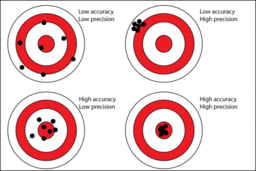

```{r run-setup---dont-delete, child = "slide-setup.Rmd"}
```


layout: true

<div class="my-footer">
  <span>
  Instructor | Lecture | <a href="https://molb7950.netlify.app/">MOLB 7950 website</a>
  </span>
</div> 

---

## N.B.: Copy this Rmd to a new slide!

Don't edit this slide directly, as we will likely want to pull new content from 
the block-template repo.

---

## Required: Contact Info 

Greetings experimentalist humans `r emo::ji("wave")`

<i class="fa fa-envelope"></i> &nbsp; [email@address.edu](mailto:email@address.edu) <br>

---

## Required: Learning Objectives

Write a list of learning objectives. [Some tips](https://www.bu.edu/cme/forms/RSS_forms/tips_for_writing_objectives.pdf) for this.

.pull-left[
* Define three characteristics of DNA sequencing that drive error rate
* Define false disovery rate
* Define precision and recall
* Compare precision and accuracy
]

.pull-right[]

---

## Required: Rigor & Reproducibility

Include a dedicated slide for R&R issues to be considered in the lecture.

Keep this slide in a conspicuous location and don't change the title so that
we can collate if needed.

---

## Required: Problem Set and Grading Rubric

Include a dedicate slide describing problem set assignment with a link
to the [grading rubric](https://molb7950.netlify.app/policies/).

Mention whether this problem set will be graded by peers or instructors/TAs.

---

## Optional: Further Reading 

Include a list of interesting papers, book chapters, websites for further reading.

---

## Example: showing code

.center[
```{r show-code}
ggplot(mtcars, aes(mpg, hp)) + geom_point()
```
]
---

## Example: showing code, side-by-side

.code-left[
```{r plot-label, eval=FALSE}
ggplot(mtcars,
  aes(mpg, hp, color = factor(cyl))) +
  geom_point(size = 4) +
  theme_minimal_grid() +
  scale_color_OkabeIto() #<<
```
]

.plot-right[
```{r plot-label-out, ref.label='plot-label', out.width = '100%', echo=FALSE}
```
]

---

## xaringan resources

- [Rmarkdown xaringan chapter](https://bookdown.org/yihui/rmarkdown/xaringan.html)
- [xaringanthemer](https://pkg.garrickadenbuie.com/xaringanthemer/) from G. Aden-Buie
- rstudio::conf slides from A. Hill [[slides](https://arm.rbind.io/slides/xaringan.html)][[source](https://github.com/rstudio-education/arm-workshop-rsc2019/blob/master/static/slides/xaringan.Rmd)]
- [Progressive xaringan](https://www.garrickadenbuie.com/blog/better-progressive-xaringan/)

Get a real-time preview of your slides as you develop:
```
> xaringan::infinite_moon_reader()
```
